# CardGame2 – Wiki

## Sommaire
- [1. Jeu : Règles et fonctionnement](#1-jeu--règles-et-fonctionnement)
  - [But du jeu](#but-du-jeu)
  - [Déroulement d'une partie](#déroulement-dune-partie)
  - [Effets et mécaniques](#effets-et-mécaniques)
  - [Statuts et interactions élémentaires](#statuts-et-interactions-élémentaires)
  - [FAQ](#faq)
- [2. Cartes : Types et affichage](#2-cartes--types-et-affichage)
  - [Exemple d'affichage d'une carte](#exemple-daffichage-dune-carte)
  - [Unités](#unités)
  - [Héros](#héros)
  - [Sorts & Équipements](#sorts--équipements)
- [3. Decks et Collection](#3-decks-et-collection)
- [4. Interface et accessibilité](#4-interface-et-accessibilité)
- [5. Avancées, extensions et communauté](#5-avancées-extensions-et-communauté)
- [6. Glossaire et conseils](#6-glossaire-et-conseils)

---

## 1. Jeu : Règles et fonctionnement

### But du jeu
Construire un deck, affronter l'IA ou d'autres joueurs, collectionner toutes les cartes et optimiser ses stratégies.

### Déroulement d'une partie
- Chaque joueur commence avec un héros et 4 unités sur le terrain.
- Pioche initiale de 5 cartes, puis 1 carte piochée par tour.
- Mana pour jouer des cartes, activation de capacités spéciales, gestion des statuts.
- Victoire par réduction des PV du héros adverse à 0.

### Effets et mécaniques
- **Effets temporaires** : poison, boost, shield, freeze, etc.
- **Effets permanents** : bonus/malus, auras, passifs.
- **Interactions élémentaires** : Feu > Glace, Eau > Feu, etc.

#### Exemples d'effets
- **Poison** : inflige des dégâts chaque tour.
- **Boost** : augmente temporairement l'attaque.
- **Shield** : absorbe les dégâts, soigne à l'expiration.

### Statuts et interactions élémentaires
- Liste complète des statuts (poison, gel, silence, etc.).
- Tableau des faiblesses élémentaires.

### FAQ
- Questions fréquentes sur les règles, la collection, les boosters, etc.

---

## 2. Cartes : Types et affichage

### Exemple d'affichage d'une carte
```
┌─────────────────────────────┐
│  [Image]                    │
│  Nom : Pyrodrake            │
│  Type : Unité               │
│  Rareté : Mythic            │
│  Coût : 5                   │
│  ATK : 72   DEF : 22   PV : 1200
│  Description : Explosion : inflige des dégâts élément feu...
└─────────────────────────────┘
```
- **Icônes d'effets** affichées en overlay.
- **Tooltip** détaillé au survol.

### Unités
| Image | Nom | Rareté | ATK | DEF | PV | Élément | Description |
|-------|-----|--------|-----|-----|----|---------|-------------|
| 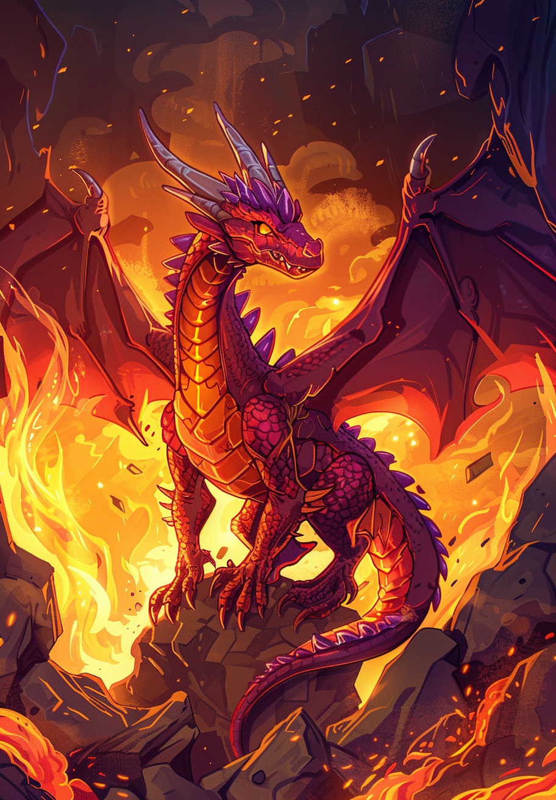 | Pyrodrake, Dragon de Braise | Mythic | 72 | 22 | 1200 | Feu | Explosion : inflige des dégâts élément feu avec un effet secondaire. Si la cible est Gelée : annule Gel, cible est maintenant Échaudée (soins reçus -30%, 1 tour). Si la cible est Mouillée : annule Mouillé et la rend sous 'Vapeur' (précision -15%, 1 tour). |
| 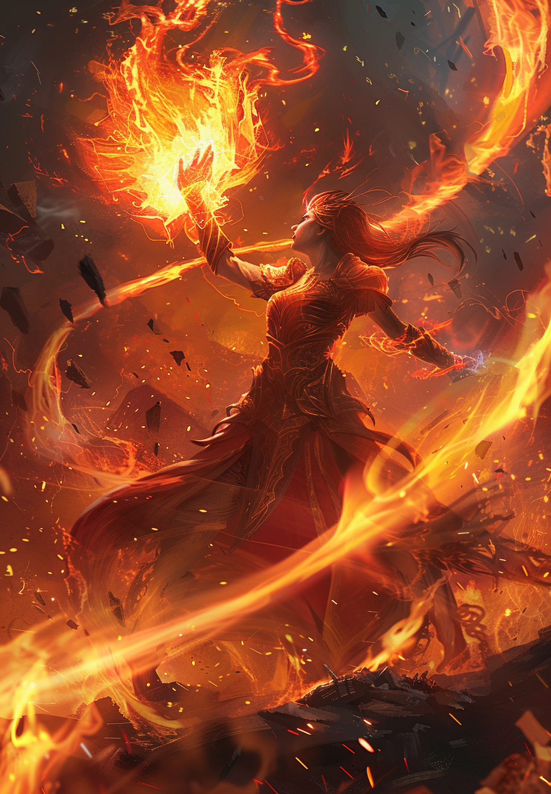 | Salamandra, Magicienne Incandescente | Epique | 63 | 16 | 950 | Feu | Souffle ardent : inflige des dégâts élément feu avec un effet secondaire. 50% de Brûlure. Si la cible est Mouillée : retire Mouillé, applique Vapeur (précision -15%). Si la cible est Gelée : annule Gel, cible Échaudée (soins -30%). |
| 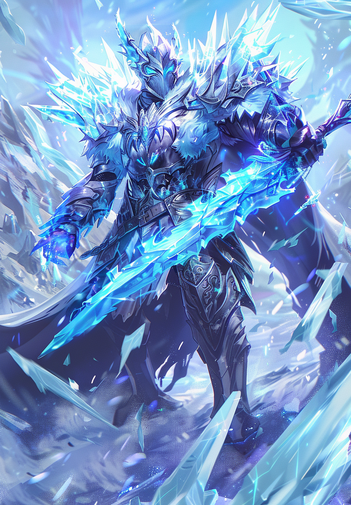 | Gelidar, Chevalier des Neiges | Special | 54 | 28 | 1100 | Glace | Fracas glacé : inflige des dégâts élément glace avec un effet secondaire. Si la cible est Brûlée : éteint Brûlure, pas de dégât bonus. Si cible déjà Gelée : applique Fragilisé (DEF -20%, 1 tour). |
| 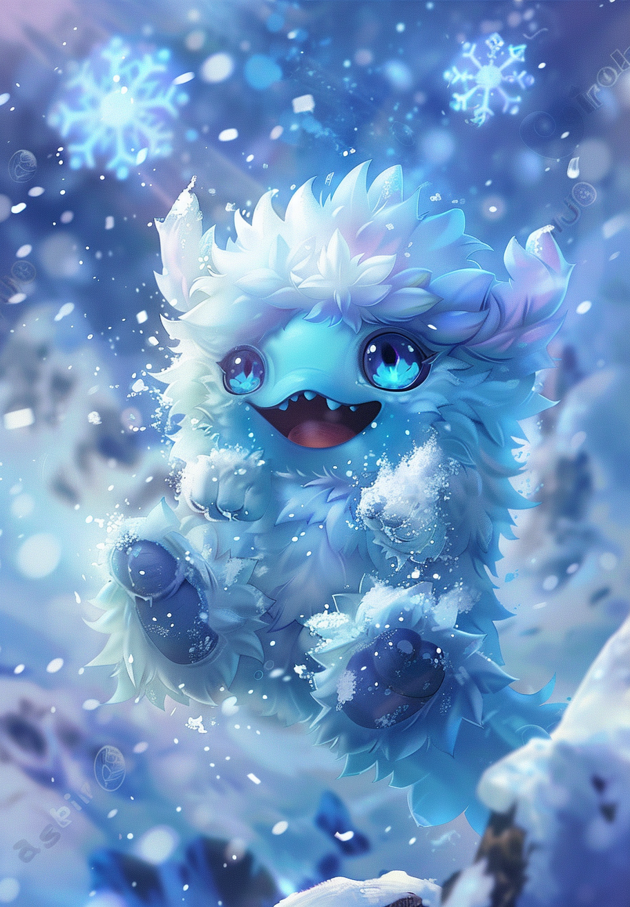 | Frimousse, Esprit Givré | Common | 48 | 13 | 780 | Glace | Fracas glacé : inflige des dégâts élément glace avec un effet secondaire. Si cible sous Brûlure : retire Brûlure. Si cible déjà Gelée : double le malus de vitesse et applique Fragilisé (DEF -20%, spécialité). |
| 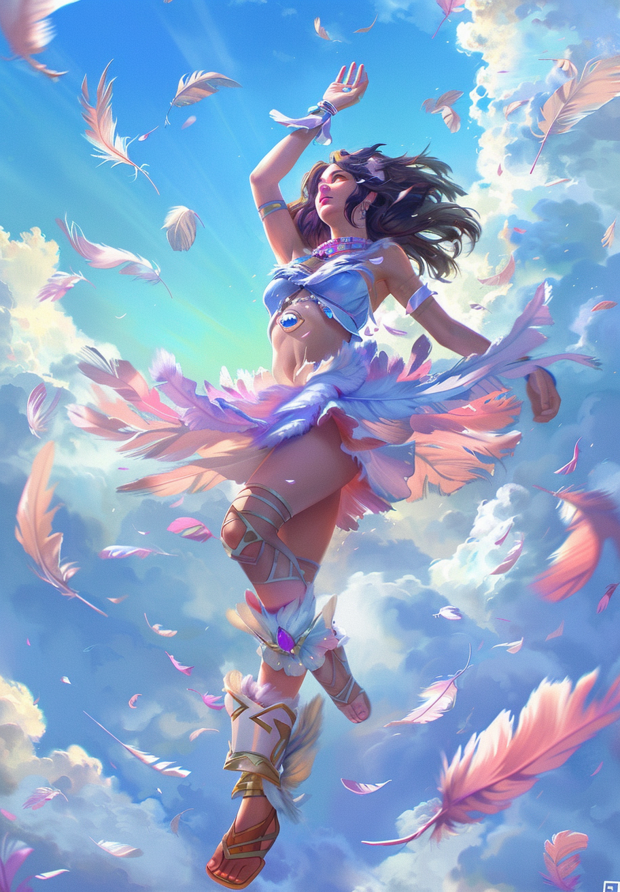 | Skyla, Danseuse des Nuages | Rare | 59 | 21 | 1010 | Air | Vague Purificatrice : Soigne 52 PV à un allié et retire Brûlure, applique Mouillé (DEF -10%) à un ennemi. Si la cible ennemie subit Feu/Foudre ensuite, interaction selon combo. |
| 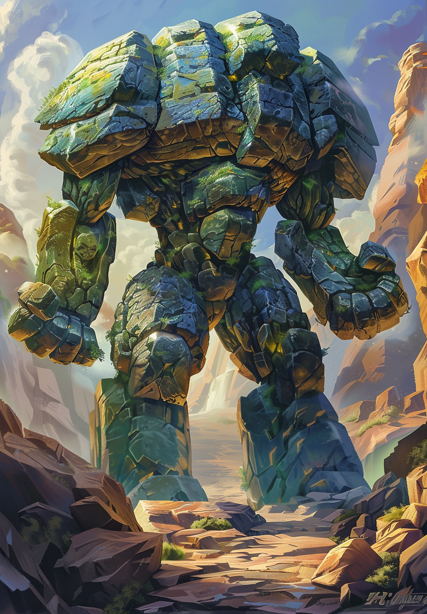 | Rock, Colosse de Granit | Uncommon | 58 | 13 | 810 | Terre | Onde sismique : inflige des dégâts élément terre avec un effet secondaire. Si Bouclier adverse : 50% de chance de l'ignorer. |
| 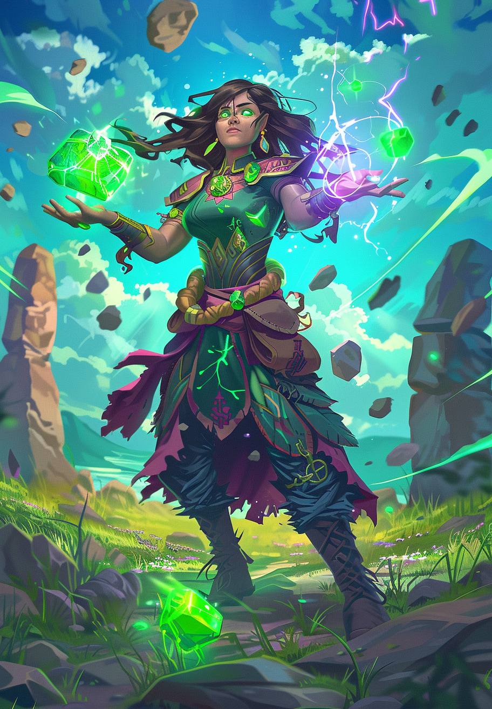 | Terra, Sorcière de la Terre | Epique | 41 | 42 | 1470 | Terre | Mur de pierre : inflige des dégâts élément terre avec un effet secondaire. Si subit Air : Air ne peut ignorer ce bouclier. [Boost: +5% PV/ATK, +1 DEF, promue EPIQUE] |
| 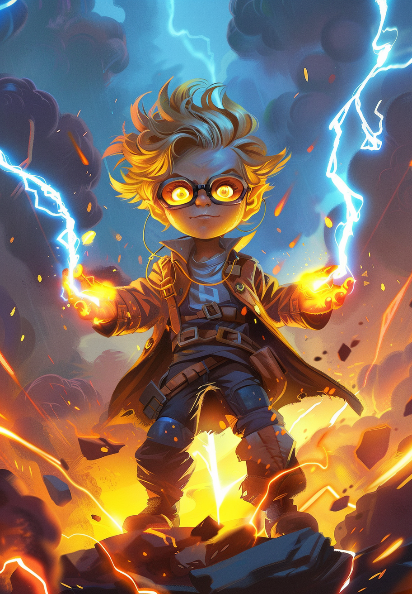 | Stormy, Enfant de la Foudre | Uncommon | 51 | 16 | 825 | Foudre | Évasion Spectrale : Esquive automatique prochaine attaque. En cas de Bouclier adverse : 33% de retirer le bouclier. Si face Terre : cette esquive saute (Terre ancre, spécialité). |
| 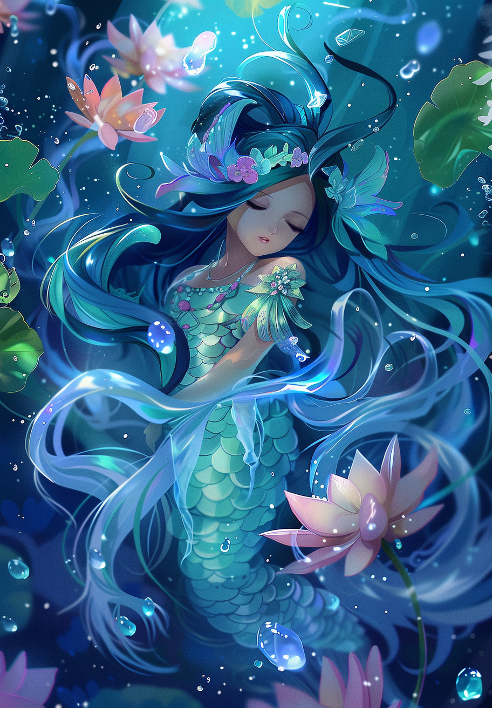 | Cristaline, Ondine Pure | Common | 44 | 11 | 840 | Eau | Souffle Vicié : Empoisonne (DoT 10/2t, 2 tours) 2 ennemis. Vague : inflige des dégâts élément eau avec un effet secondaire. |
|  | Sylphar, Archer de la Canopée | Epique | 63 | 19 | 1008 | Air | Soin Revigorant : Rend 47 PV à un allié, retire 1 affliction (Poison, Paralysie, Silence…). Esquive accrue : inflige des dégâts élément air avec un effet secondaire. [Boost: +5% PV/ATK, +1 DEF, promue EPIQUE] |
| 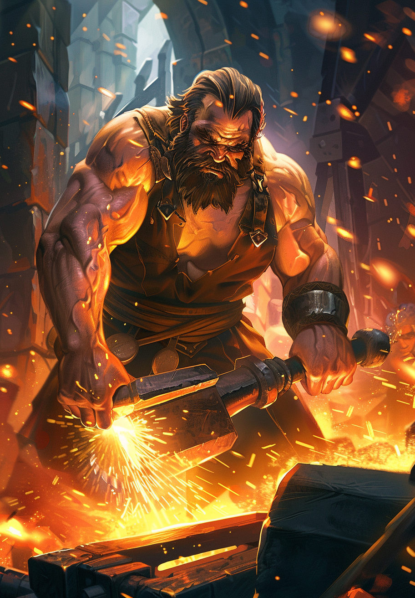 | Vulcan, Forgeron de l'Enclume Ardente | Epique | 67 | 15 | 940 | Feu | Souffle ardent : inflige des dégâts élément feu avec un effet secondaire. Si ce bouclier casse à cause d'une attaque de Feu : l'attaquant subit Gel (1 tour). Si brisé par Air : retire aussi un bonus du porteur (anti-buff Air). |
| 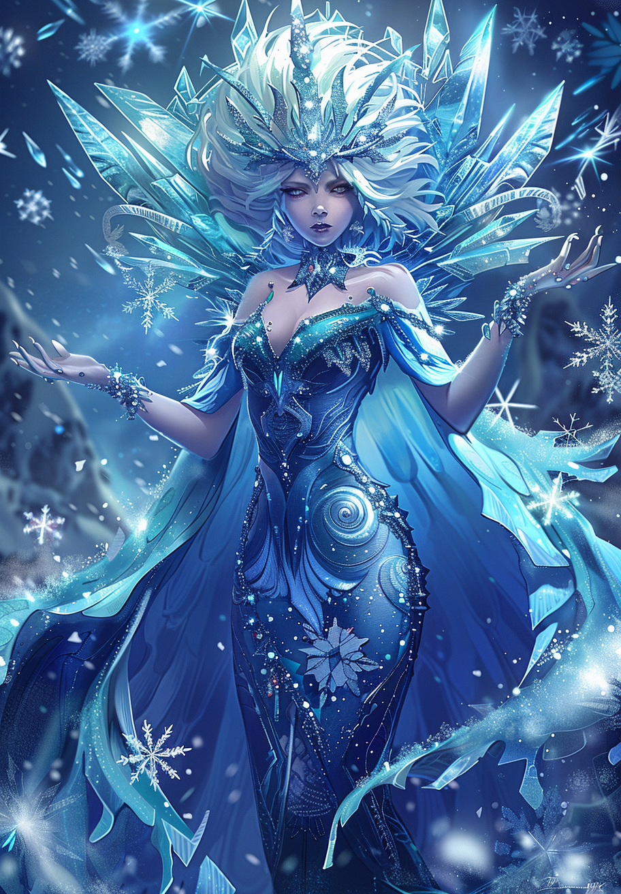 | Glacielle, Reine des Flocons | Rare | 59 | 20 | 1040 | Glace | Gel : inflige des dégâts élément glace avec un effet secondaire. Double contre cibles Ténébreuses (Thématique Lumière/Ténèbres). |
| 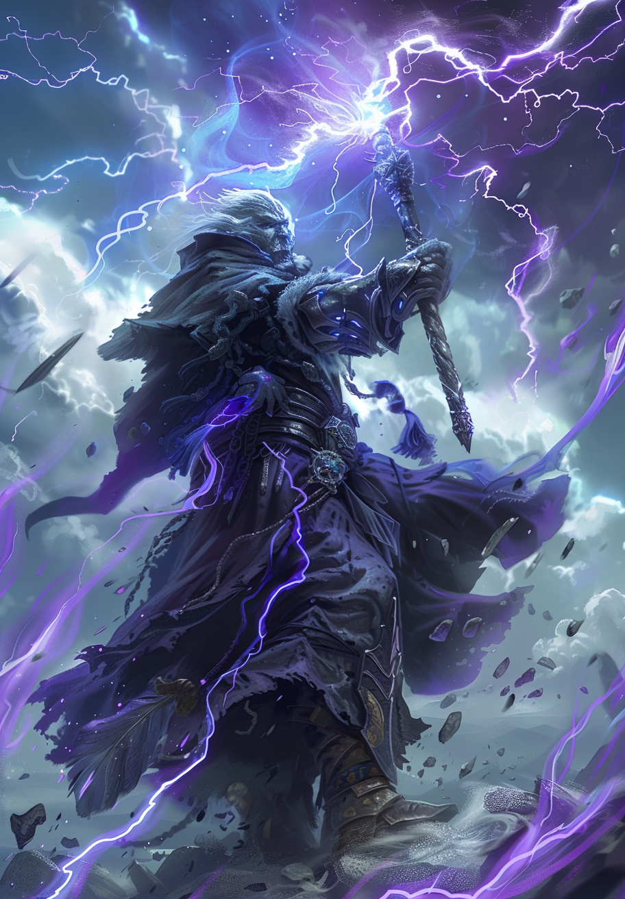 | Voltar, Seigneur de l'Orage | Rare | 58 | 18 | 1080 | Foudre | Nuit Insondable : Tous les ennemis subissent Silence (1 tour). Étincelle : inflige des dégâts élément foudre avec un effet secondaire. |
| 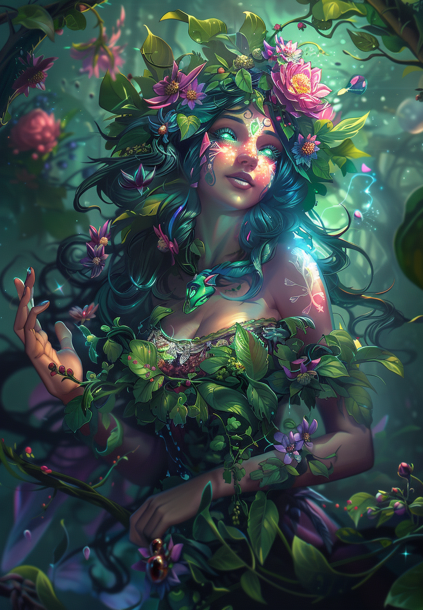 | Floralia, Druidesse des Fleurs | Uncommon | 46 | 28 | 990 | Terre | Bouclier : inflige des dégâts élément terre avec un effet secondaire. Si cible Mouillée : Poison +5 dég./tour. Mur de pierre : inflige des dégâts élément terre avec un effet secondaire. |
| 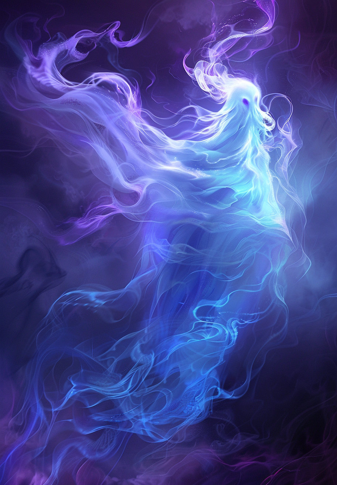 | Nébulo, Fantôme du Brouillard | Mythic | 53 | 34 | 1220 | Air | Rafale : inflige des dégâts élément air avec un effet secondaire. Si ce bouclier est brisé par Feu : tous les alliés gagnent Mouillé (la lumière invoque la rosée protectrice en dernier ressort). |
| 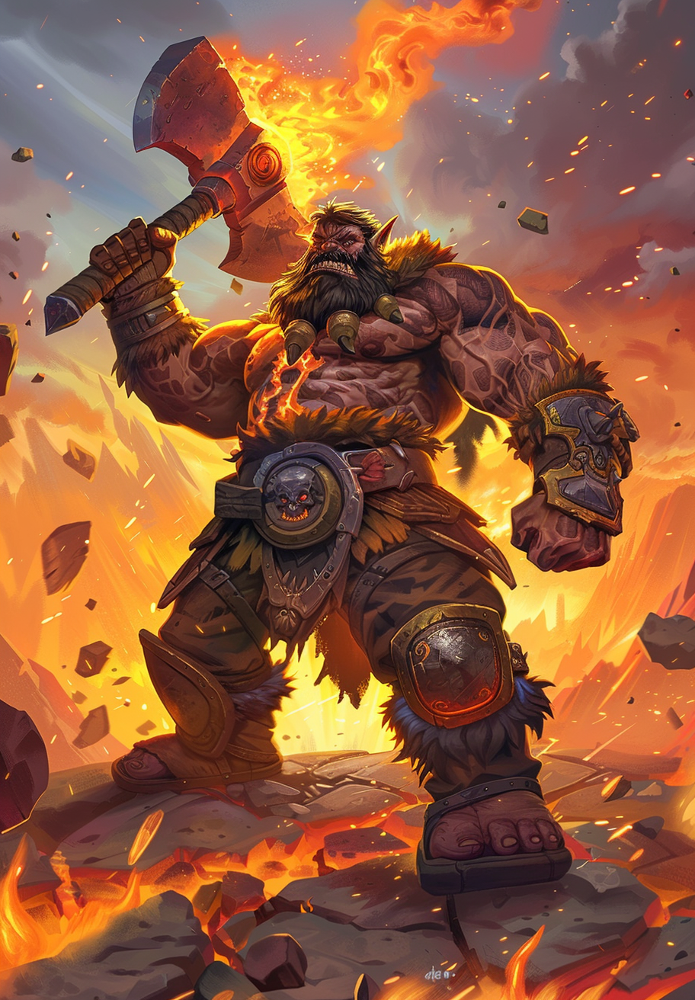 | Barbak, Guerrier Barbare | Rare | 68 | 18 | 1130 | Terre | Rage Ardente : Gagne +7 ATK si attaqué (max +35). À chaque attaque retirant un statut (Gel, Paralysie, Mouillé), Brûlure s'applique automatiquement à l'attaquant si Barbak est boosté (+2 ATK minimum). |
| 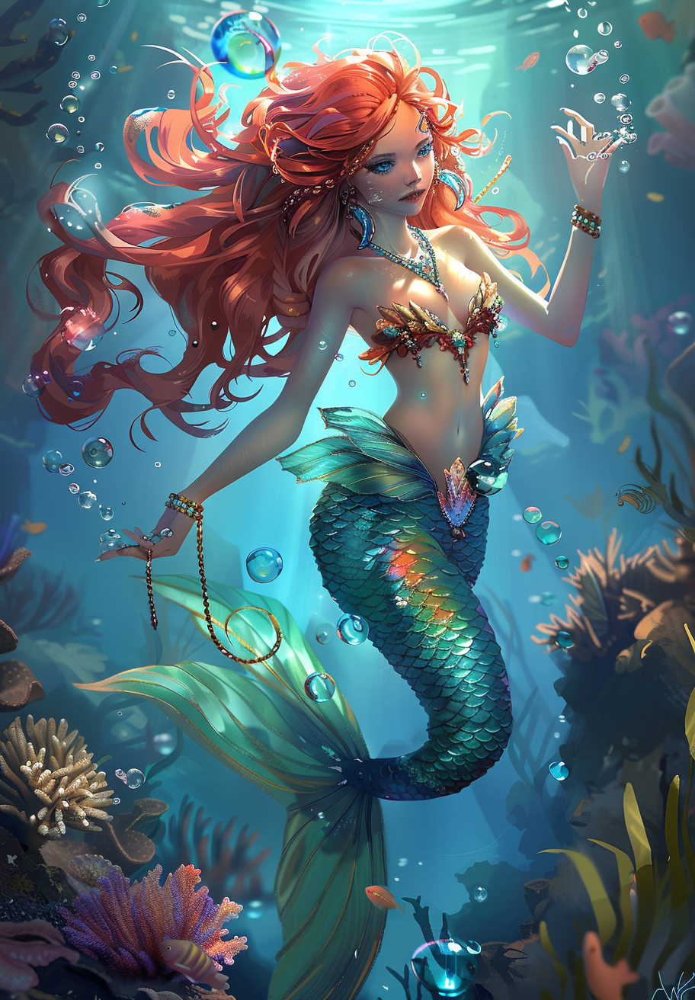 | Aquaria, Sirène Mystique | Epique | 63 | 20 | 1029 | Eau | Mélopée Hypnotique : Endort (1 tour) une cible. Si la cible Mouillée : Endormissement dure 2 tours (Eau prolonge ses propres statuts). Si Brûlée : retire Brûlure avant d'appliquer le sommeil. [Boost: +5% PV/ATK, +1 DEF, promue EPIQUE] |
| 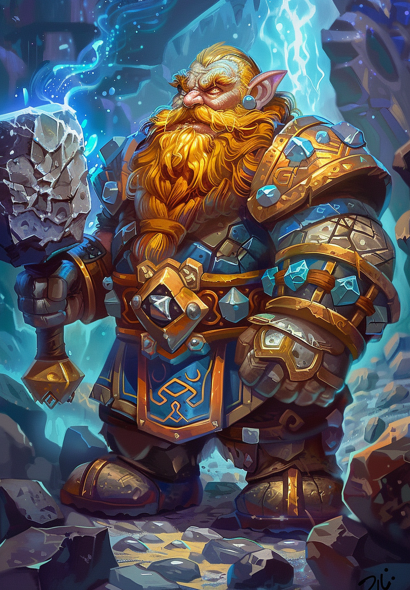 | Bersi, Nain Invincible | Uncommon | 55 | 30 | 1160 | Terre | Onde sismique : inflige des dégâts élément terre avec un effet secondaire. Immunise contre Provocation et Mouillé (Terre : stabilité). Mur de pierre : inflige des dégâts élément terre avec un effet secondaire. |
| 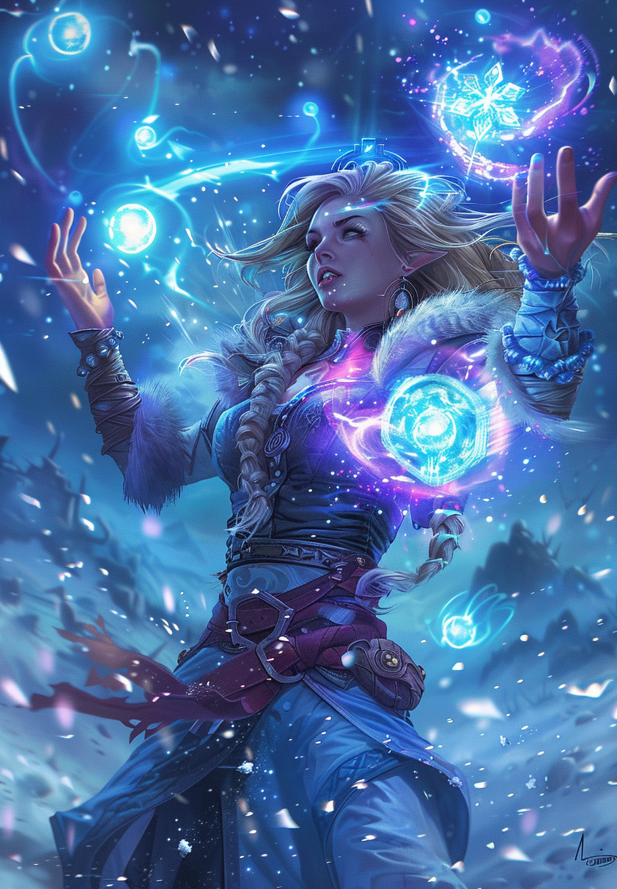 | Orbaline, Magicienne Astrale | Rare | 73 | 10 | 870 | Air | Attaque de base : inflige des dégâts élément air/glace avec un effet secondaire. Si cible Bouclier : 50% d'ignorer le Bouclier. |
| 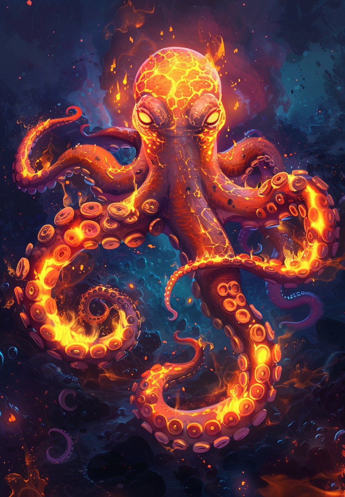 | Pyropoulpe, Poulpe Incandescent | Uncommon | 63 | 18 | 995 | Feu | Attaque de base : inflige des dégâts élément feu/eau avec un effet secondaire. Sur chaque cible : 35% chance Brûlure (Feu/Eau) OU Mouillé (Feu/Eau). Si la Brûlure touche une cible Mouillée : Brûlure annulée, applique Vapeur (-15% précision, 1 tour). |
| 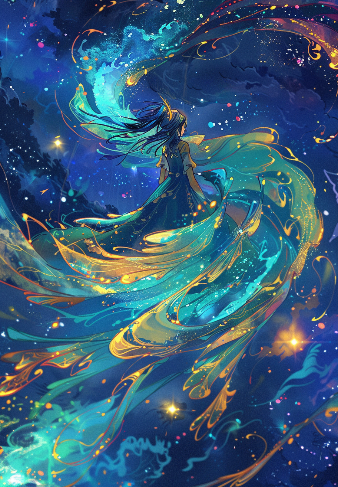 | Galaxine, Voyageuse Céleste | Mythic | 75 | 19 | 1100 | Air | Rafale : inflige des dégâts élément air avec un effet secondaire. |
| 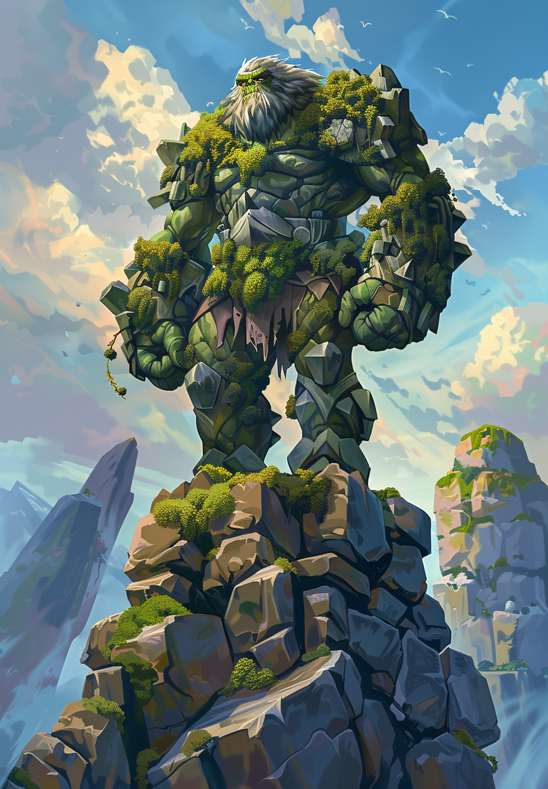 | Silex, Gardien du Pic Rugueux | Rare | 65 | 14 | 900 | Terre | Mur de pierre : inflige des dégâts élément terre avec un effet secondaire. Si cible Mouillée : applique Vapeur (-15% Précision) plutôt que Brûlure. Si cible Gelée : retire Gel en priorité. |
| 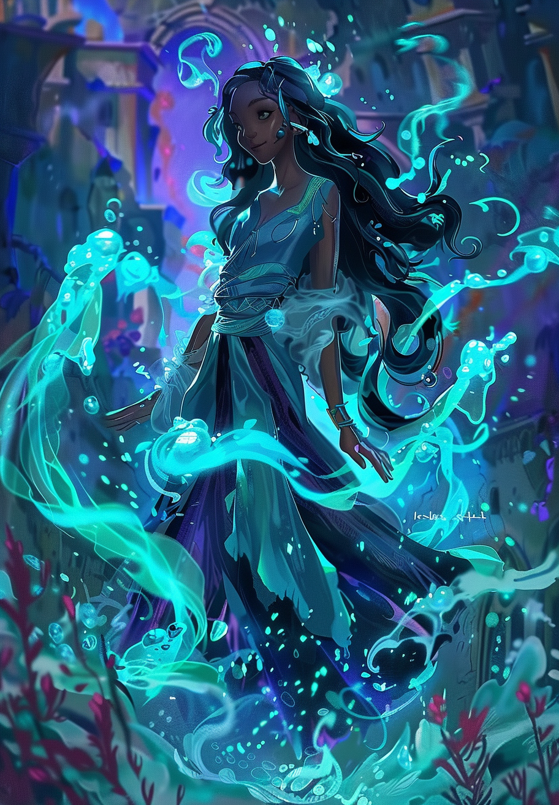 | Siriona, Enchanteresse des Abysses | Epique | 55 | 34 | 1200 | Eau | Purification : inflige des dégâts élément eau avec un effet secondaire. Empêche les cibles Air d'esquiver (Terre > Air). Si cible sous Bouclier : 50% de casser le bouclier directement. |
| 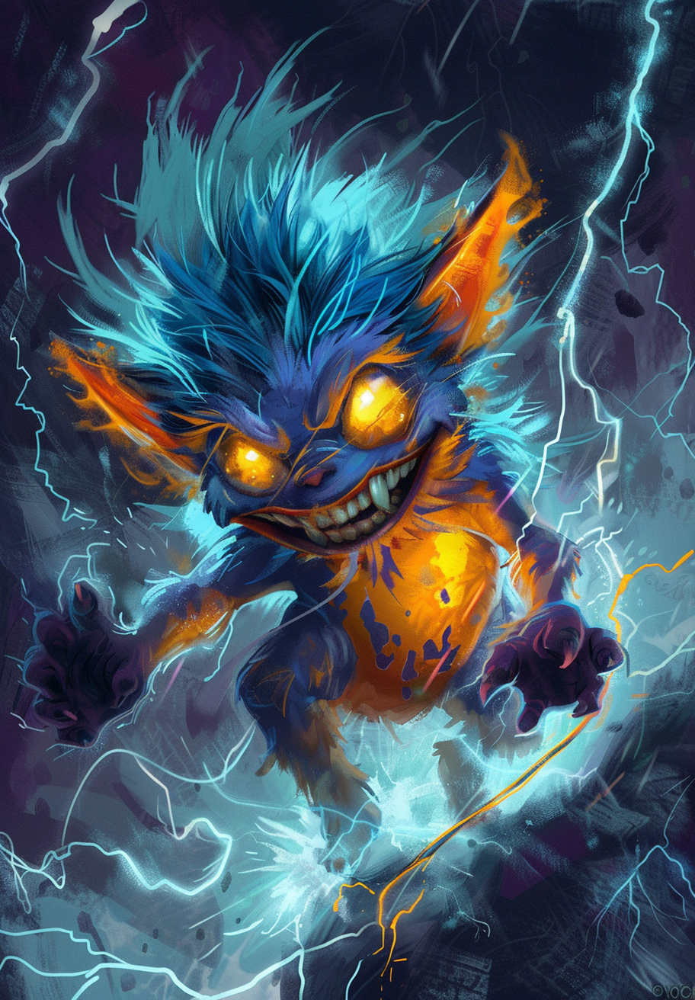 | Voltix, Lutin Électrique | Epique | 62 | 14 | 935 | Foudre | Orage : inflige des dégâts élément foudre avec un effet secondaire. Si cible Brûlée : retire Brûlure, applique Mouillé. [Boost: +5% PV/ATK, +1 DEF, promue EPIQUE] |
| 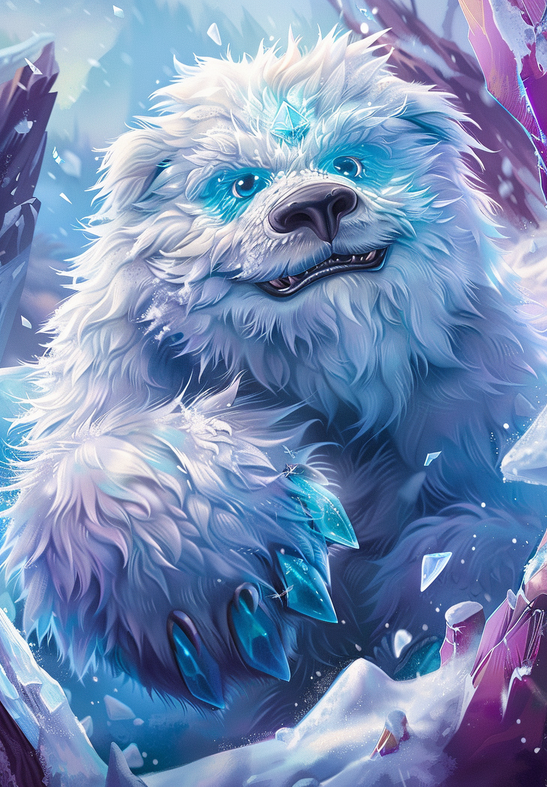 | Glacia, Yéti Polaire | Uncommon | 54 | 20 | 945 | Glace | Fracas glacé : inflige des dégâts élément glace avec un effet secondaire. Mur de glace : inflige des dégâts élément glace avec un effet secondaire. Si la cible Gelée : retire Gel, Empoisonne. |
| 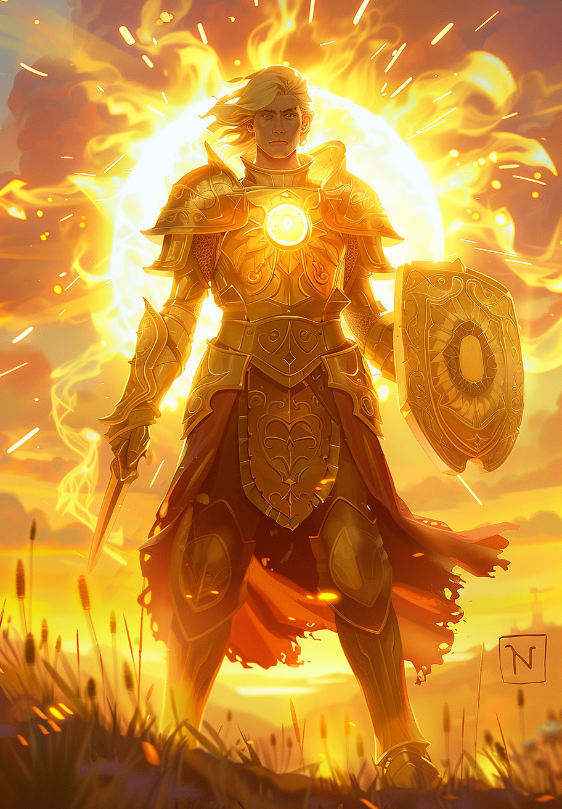 | Solaris, Paladin du Soleil | Epique | 72 | 14 | 987 | Feu | Attaque de base : inflige des dégâts élément feu/lumière avec un effet secondaire. Si cible Lumière : applique Silencieux (Silence 1 tour). Si cible Ténèbres : vol de PV doublé. [Boost: +5% PV/ATK, +1 DEF, promue EPIQUE] |
| 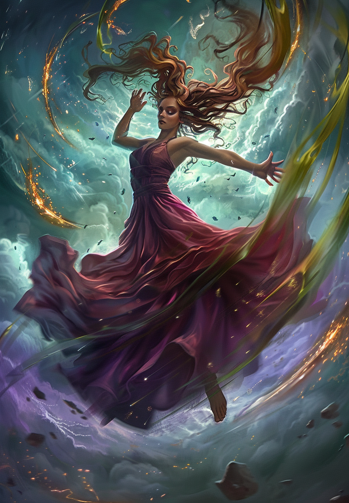 | Tempestra, Danseuse de la Tornade | Uncommon | 56 | 15 | 760 | Air | Brume Facétieuse : Esquive + Mouillé sur soi-même (esquive + Mouillé à autrui). Si ciblée par Feu : applique Vapeur sur l'attaquant (-15% précision). |
| 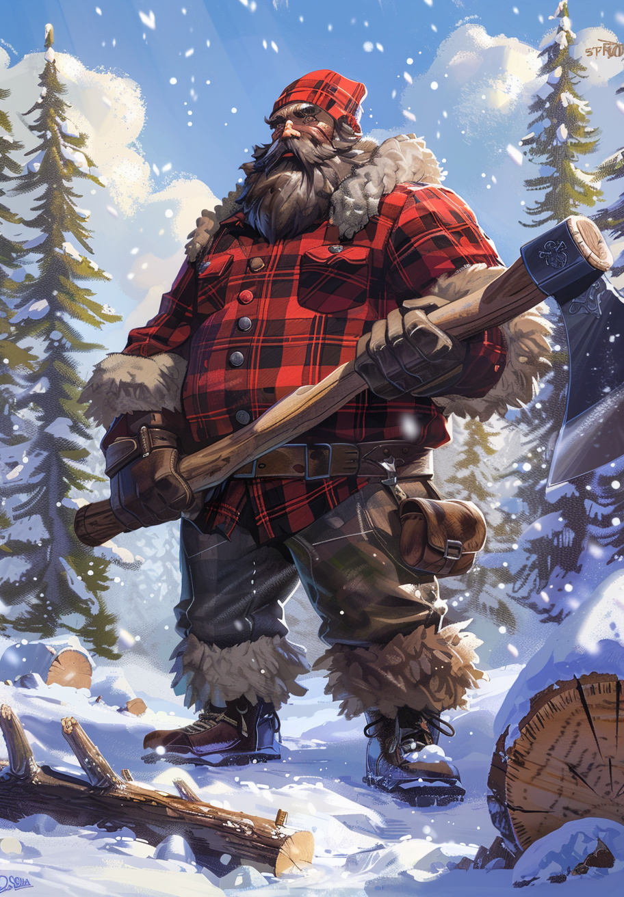 | Lumberjack, Bûcheron du Grand Nord | Rare | 58 | 29 | 1190 | Terre | Bloc Arctique : Applique Bouclier (60 points) + 40% Gel à l'attaquant si brisé. Si subit Feu : Brûlure retire Bouclier et Gel. Si Air tente d'ignorer le Bouclier : échoue (roche > vent). |
| 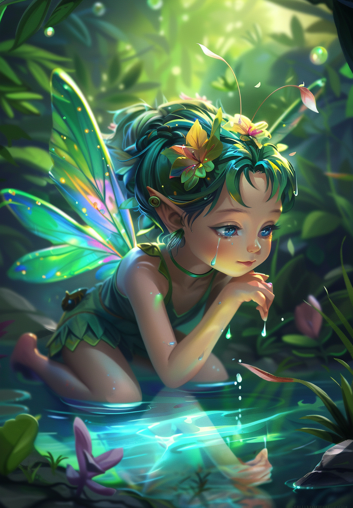 | Nixie, Fée de la Source | Rare | 66 | 12 | 890 | Eau | Soin mineur : inflige des dégâts élément eau avec un effet secondaire. Cibles Mouillées : Poison + durée. Sous Lumière : Silence sur Vesperine (lumière purifie la magie sombre). |
| 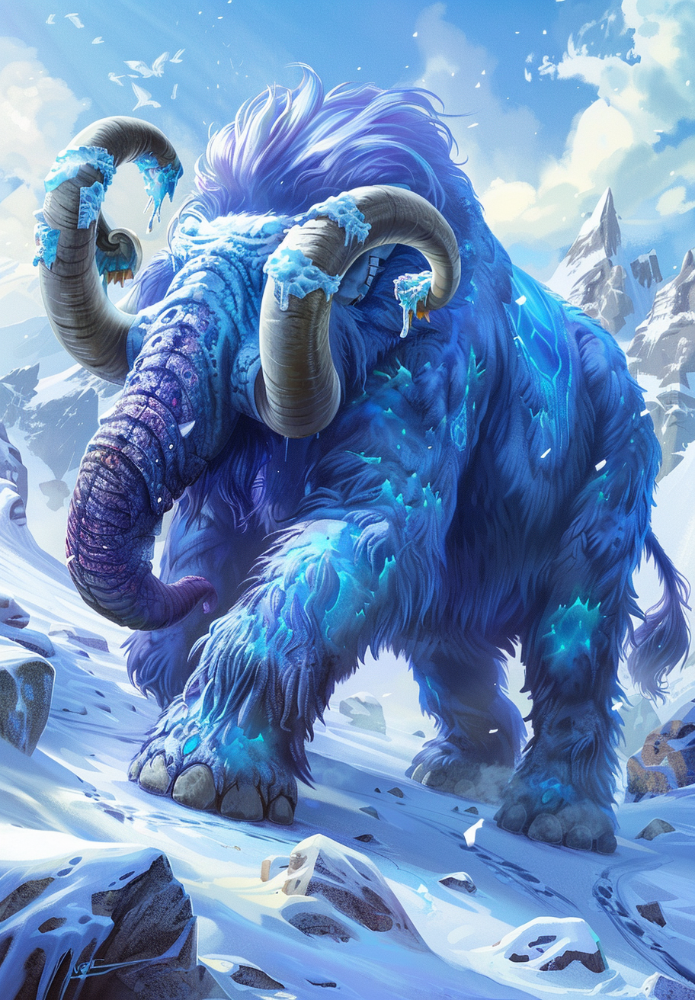 | Tundrorr, Mammouth Givré | Mythic | 70 | 22 | 1075 | Glace | Attaque de base : inflige des dégâts élément glace/terre avec un effet secondaire. Si cible Air : vole leur prochaine esquive (l'ange annule la rapidité adverse pour la donner à un allié). |
| 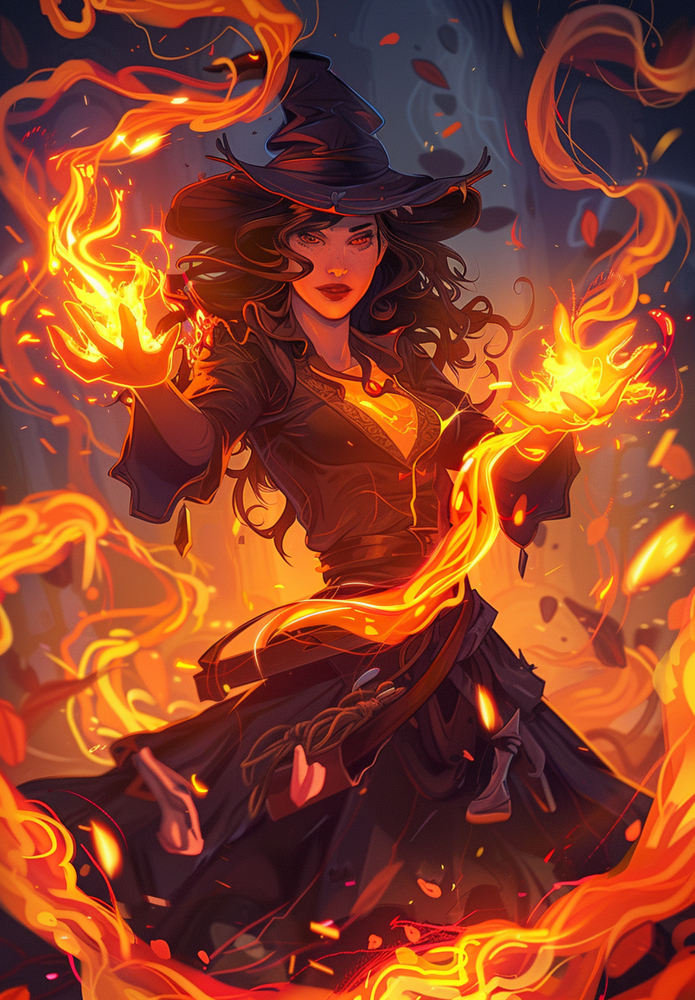 | Ignissia, Sorcière des Brasiers | Common | 49 | 15 | 850 | Feu | Brûlure : inflige des dégâts élément feu avec un effet secondaire. Si cible Mouillée : Gel garanti (l'eau gèle plus vite). Si subit Feu : perd tout bonus de DEF ce tour. |
| 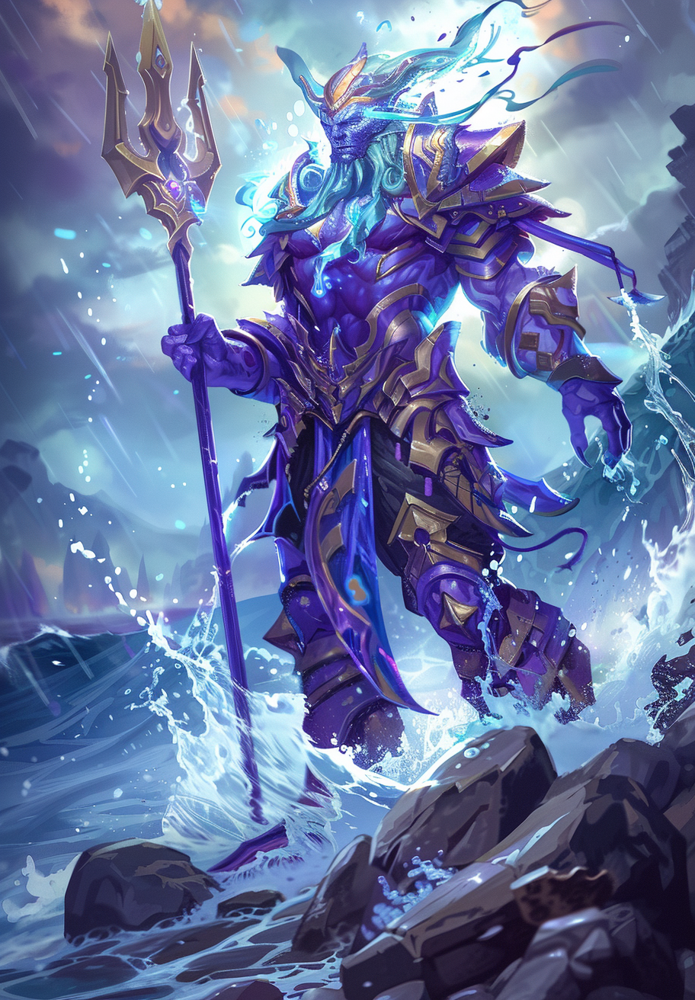 | Torrentis, Gardien de l'Écume | Common | 41 | 19 | 780 | Eau | Soin mineur : inflige des dégâts élément eau avec un effet secondaire. Si subit Eau/Air : Bouclier retiré immédiatement. Si sur Terrain Glacé : DEF doublée ce tour. |
| 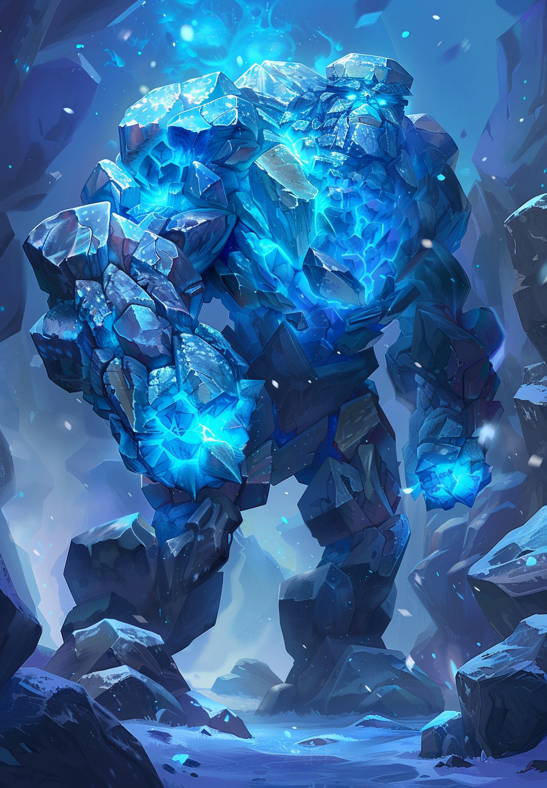 | Lixor, Golem Cristallin | Rare | 63 | 15 | 870 | Terre | Attaque de base : inflige des dégâts élément terre/glace avec un effet secondaire. Cibles Mouillées : rebondit sur 1 autre cible. Si subit Poison : ATK réduite de 10% (poison dans l'air : affaiblit). |
| 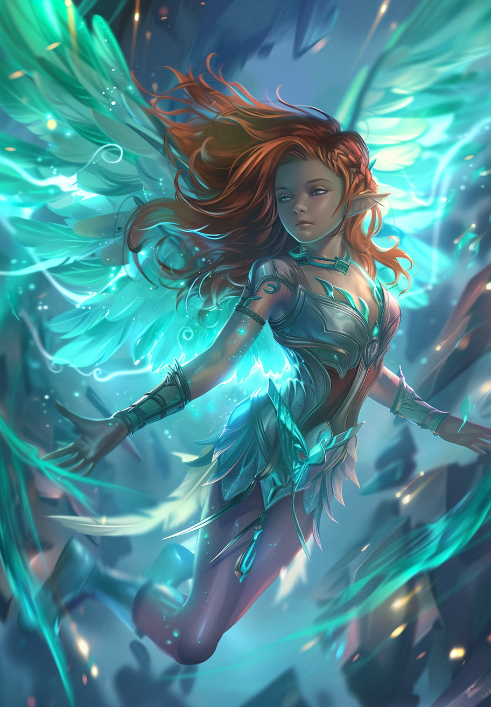 | Aeris, Esprit du Zéphyr | Epique | 72 | 12 | 950 | Air | Rafale : inflige des dégâts élément air avec un effet secondaire. Si cible Mouillée : Poison +4 dét./tour. Esquive accrue : inflige des dégâts élément air avec un effet secondaire. |
| 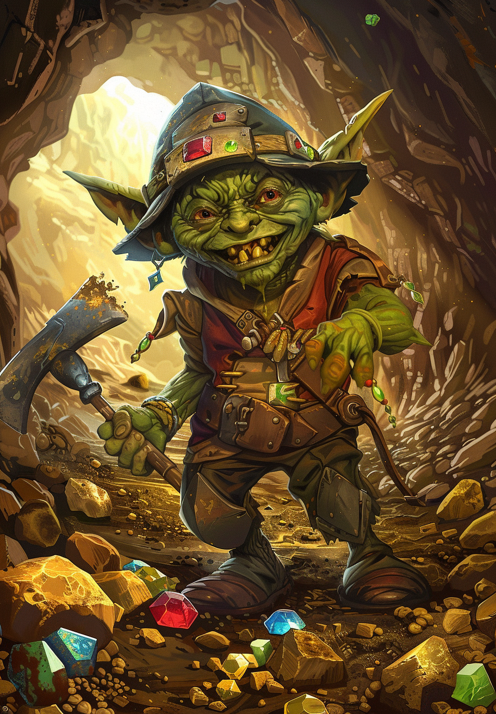 | Roktus, Gobelin Mineur | Uncommon | 55 | 12 | 845 | Terre | Mur de pierre : inflige des dégâts élément terre avec un effet secondaire. Cible Mouillée : applique Vapeur (-15% précision), Brûlure annulée. Cible Gelée : retire Gel et applique Échaudé (-30% soin reçu). |
| 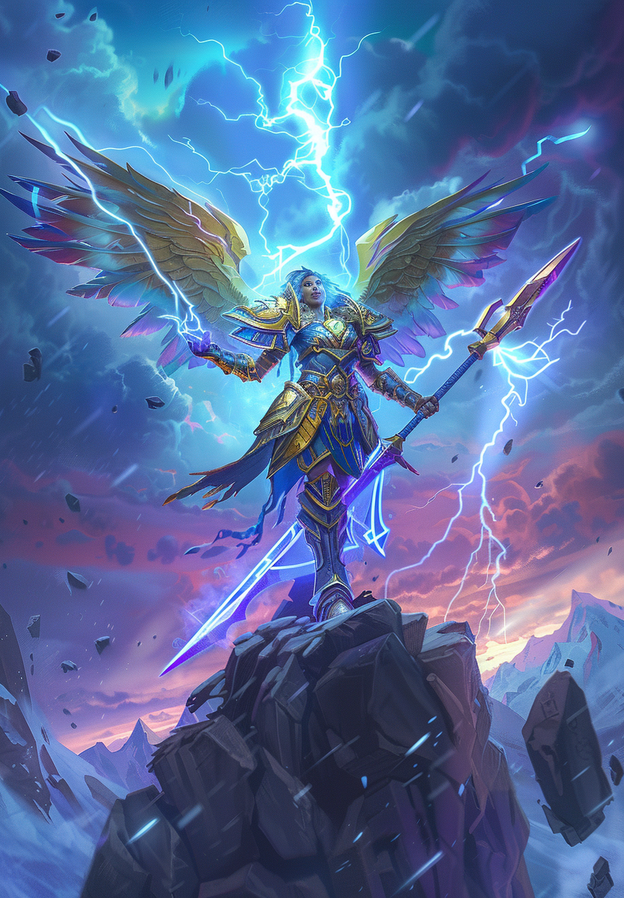 | Fulminia, Valkyrie de l'Orage | Rare | 61 | 17 | 940 | Foudre | Fulgurance Orageuse : Inflige 60 dégâts à 2 ennemis aléatoires, avec 30 % de chance d'appliquer Paralysie (1 tour). |
| 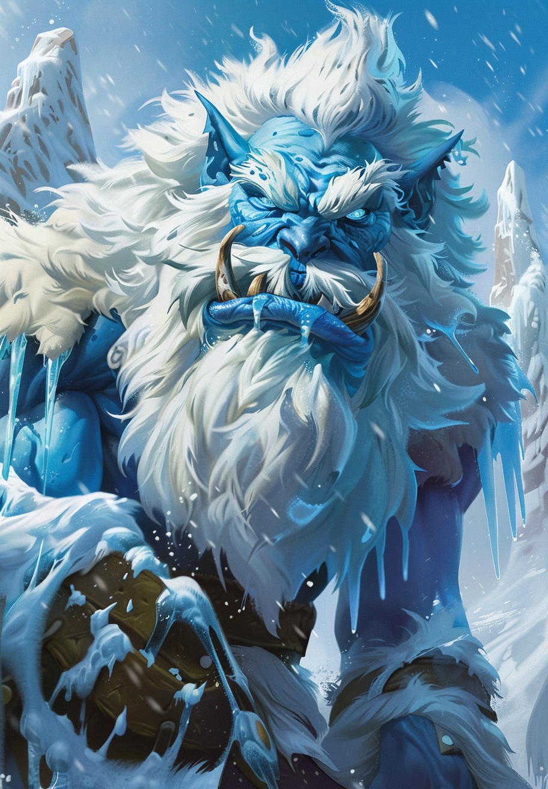 | Gelgor, Troll du Givre | Epique | 72 | 20 | 1092 | Glace | Gel : inflige des dégâts élément glace avec un effet secondaire. Si subit Air : DEF réduite de 10%. Si subit Mouillé : enlève Brûlure instantanément. [Boost: +5% PV/ATK, +1 DEF, promue EPIQUE] |
| 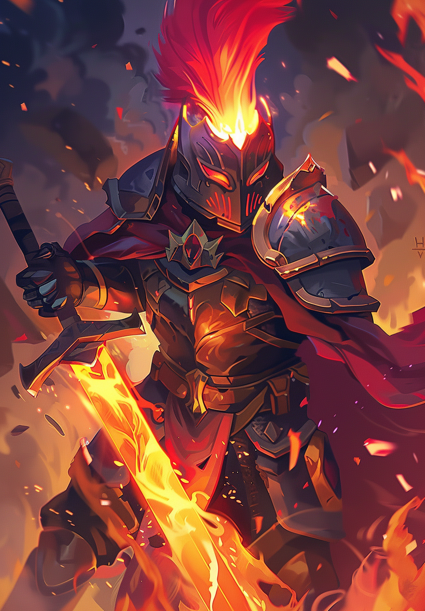 | Venturio, Chevalier Écarlate | Rare | 58 | 14 | 900 | Feu | Attaque de base : inflige des dégâts élément feu/air avec un effet secondaire. Si cible Poison déjà : DoT doublé. Si cible Terre : DEF cible réduite de 20%. |
| 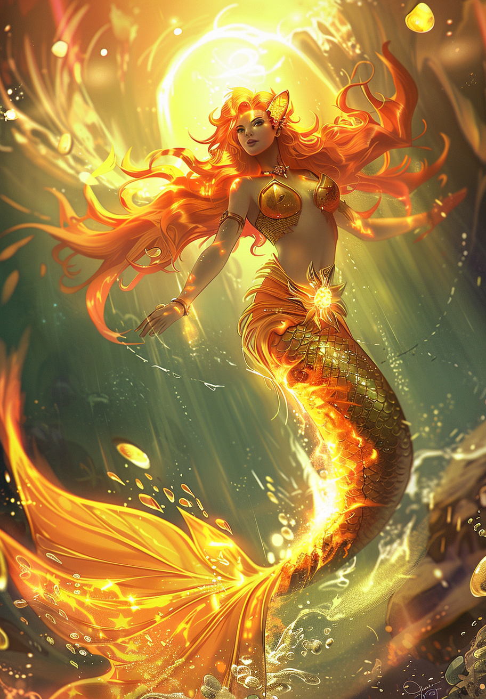 | Zyklair, Djinn des Rafales | Rare | 59 | 15 | 940 | Air | Rafale : inflige des dégâts élément air avec un effet secondaire. Ignorer Défense Bouclier (Air passe partout). Si cible Terre : ne peut esquiver ce tour (Terre ancre). |
| 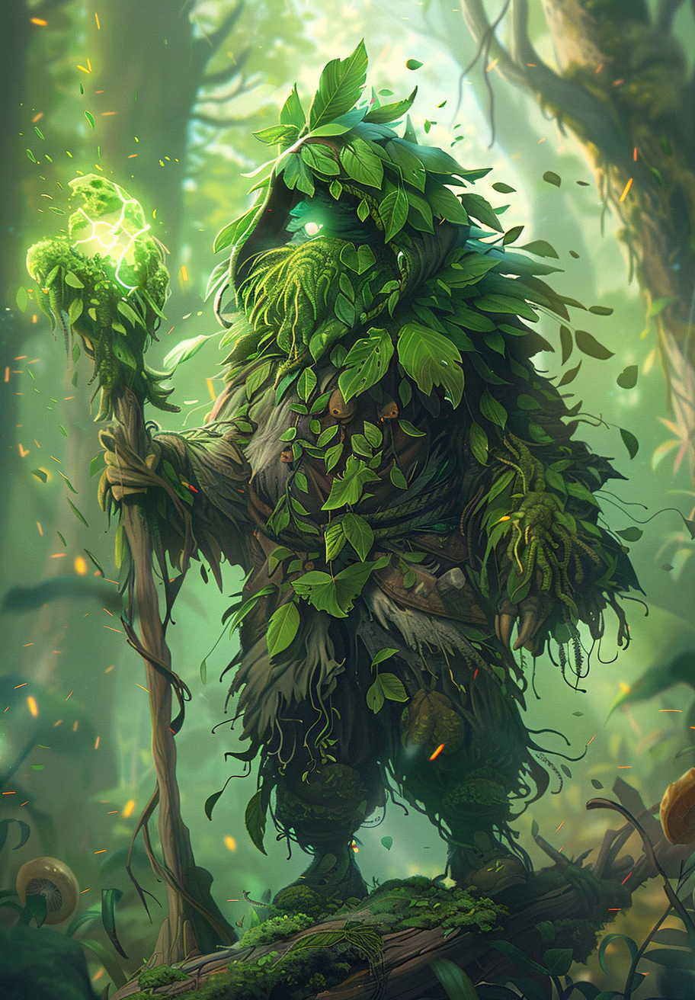 | Mossio, Shaman des Mousses | Mythic | 75 | 21 | 1020 | Terre | Bouclier : inflige des dégâts élément terre avec un effet secondaire. Si cible Mouillée : Brûlure annulée, applique Vapeur. Si cible Gelée : retire Gel, applique Échaudé (soins -30%). |
| 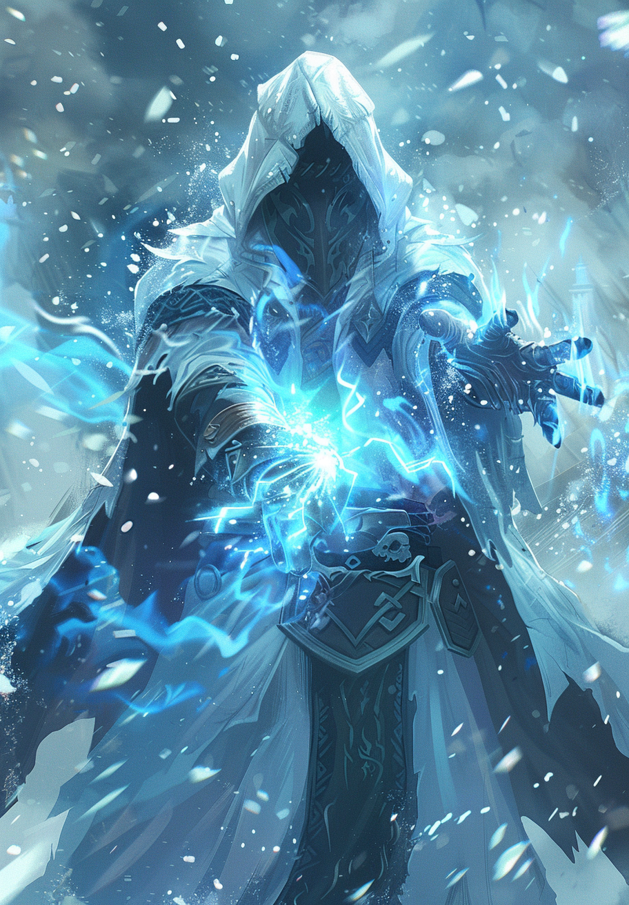 | Cryomage, Mage du Givre | Rare | 51 | 36 | 1290 | Glace | Ralentissement : inflige des dégâts élément glace avec un effet secondaire. Si subit Feu : Bouclier perd 50% d'efficacité. Si subit Air : Air ignore le bouclier à 50%. |
| 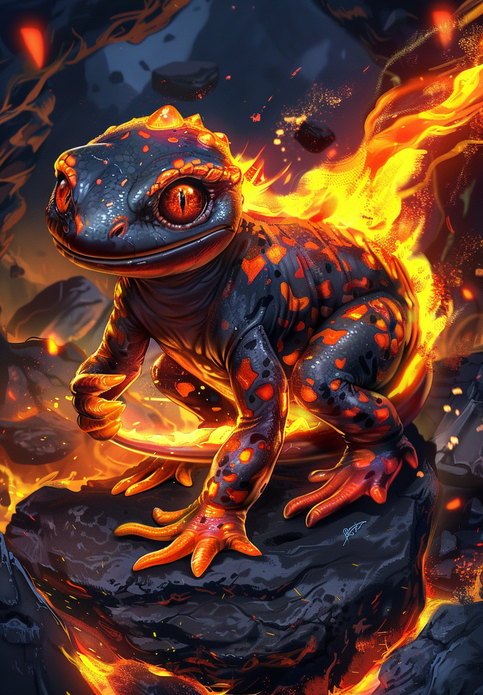 | Rubra, Salamandre Incandescente | Uncommon | 44 | 12 | 780 | Feu | Danse de Cristal : Esquive +50% pour 1 tour, 33% de chance de Geler un ennemi en esquivant. Si l'attaquant est Mouillé : Gel garanti. Si subit Feu : perd son bonus d'esquive. |
| 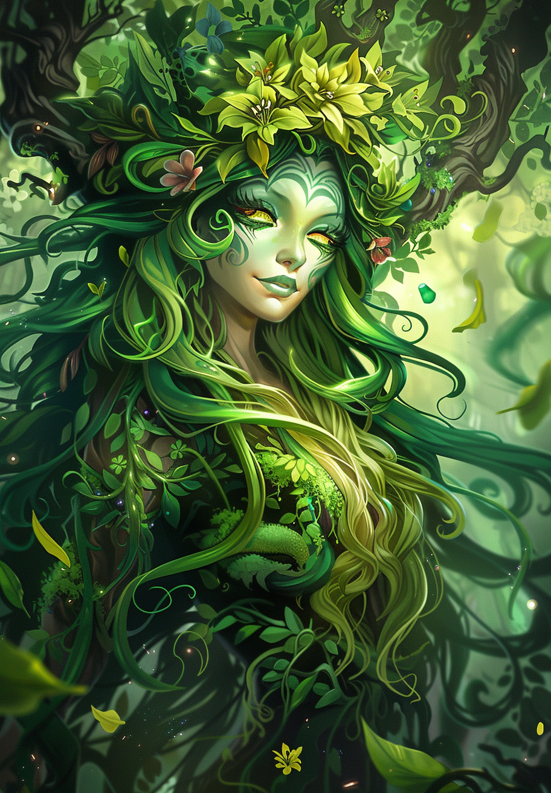 | Briselys, Dryade Mousseuse | Rare | 58 | 14 | 870 | Terre | Morsure Mortelle : Poison (DoT 10/2t), 20% Silence. Provocation : inflige des dégâts élément terre avec un effet secondaire. Si cible Mouillée : Poison DoT +2/tour. |
| 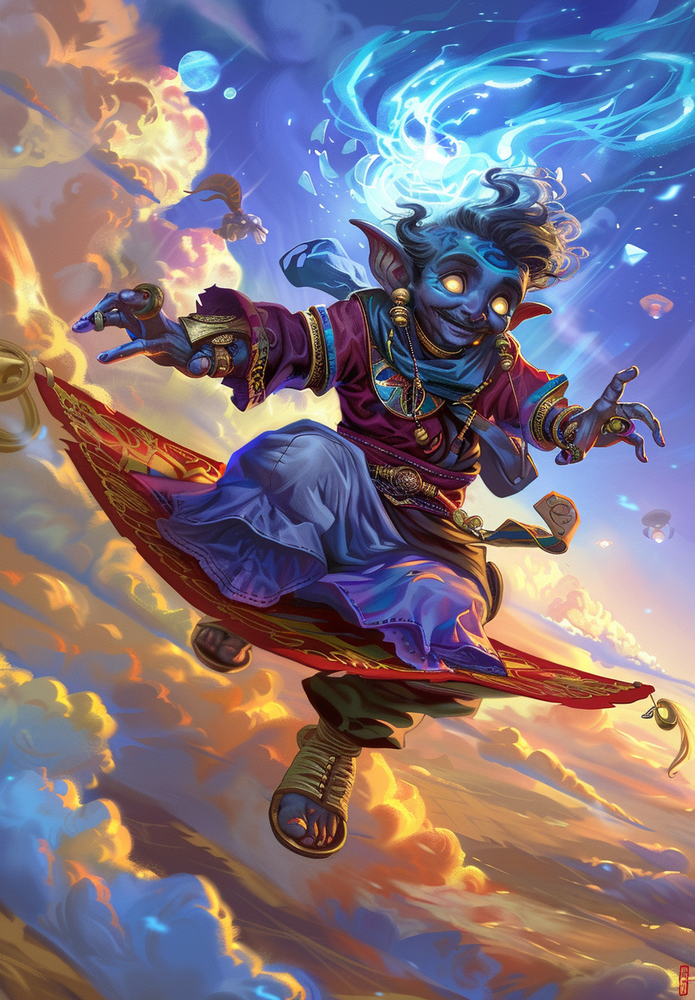 | Zepho, Génie des Courants | Uncommon | 61 | 11 | 865 | Air | Tornade : inflige des dégâts élément air avec un effet secondaire. Si cible Mouillée : applique Vapeur plutôt que Brûlure. Si subit Glace : ne peut utiliser Brûlure ce tour (seule Poison). |
| 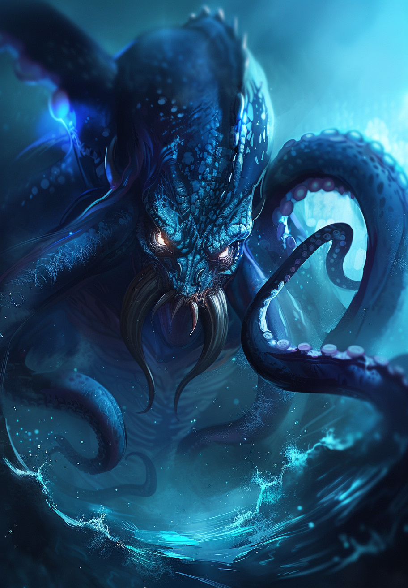 | Abyssalor, Kraken des Profondeurs | Rare | 63 | 27 | 1160 | Eau | Soin mineur : inflige des dégâts élément eau avec un effet secondaire. Si allié subit Ténèbres : Bouclier dure 1 tour de plus. Si subit Feu : Bouclier -30% d'efficacité. |
| 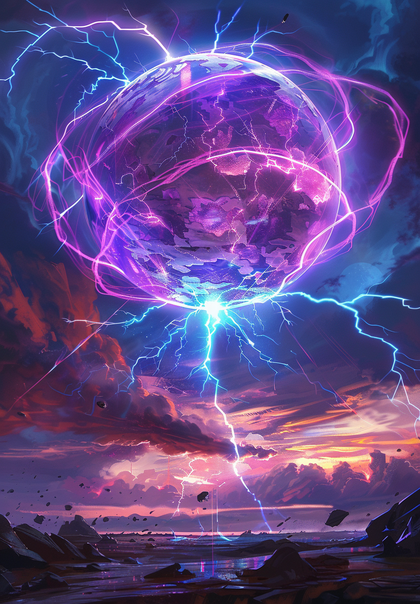 | Fulgo, Orbe Electrique | Rare | 59 | 13 | 830 | Foudre | Orage : inflige des dégâts élément foudre avec un effet secondaire. Si peut esquiver : renvoie Paralysie sur l'assaillant. Si subit Poison : perd 1 tour (état trop faible). |
| 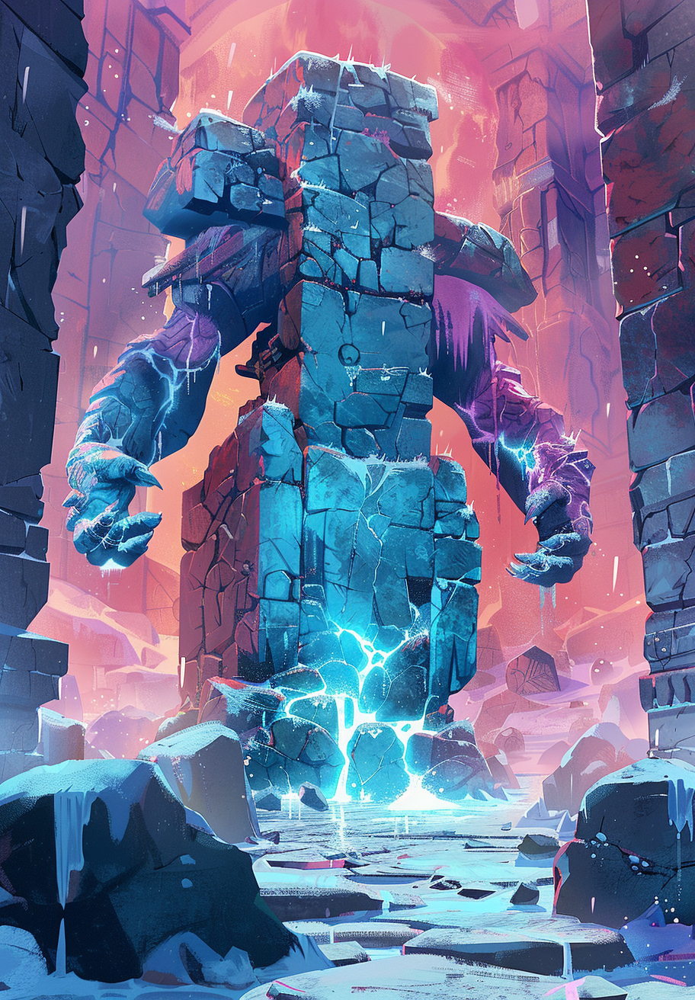 | Rocor, Gardien du Bloc | Uncommon | 47 | 17 | 880 | Terre | Attaque de base : inflige des dégâts élément terre/glace avec un effet secondaire. Si cible Poison : DoT +3/tour. Si subit Feu : regeneration impossible ce tour. |
| 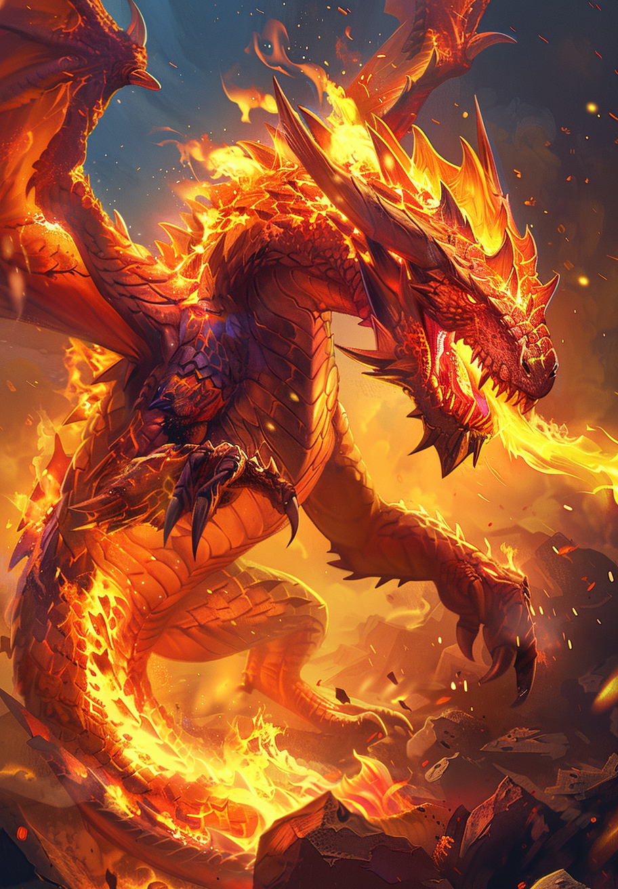 | Incendior, Dragon de Feu | Rare | 56 | 18 | 940 | Feu | Brûlure : inflige des dégâts élément feu avec un effet secondaire. Si cible Feu : Gel impossible, applique simplement -20% ATK. Si Mouillé : Gel 100%. |
| 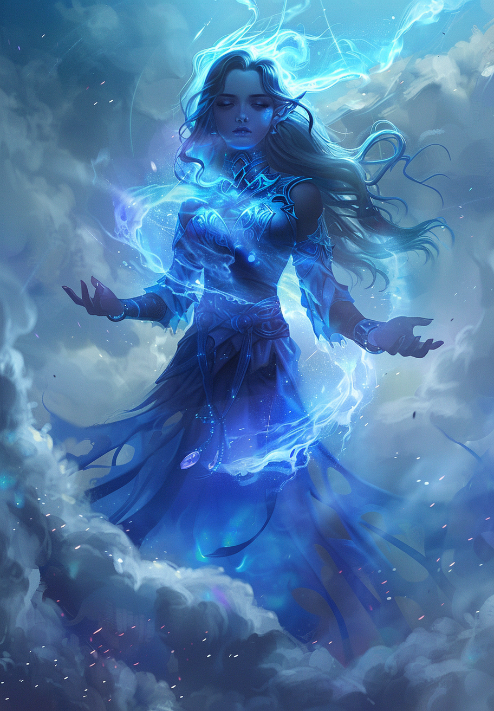 | Nébulaire, Magicienne du Brouillard | Epique | 73 | 15 | 1010 | Air | Attaque de base : inflige des dégâts élément air/eau avec un effet secondaire. Si cible Brûlée : retire Brûlure, Mouillé garanti. |
| 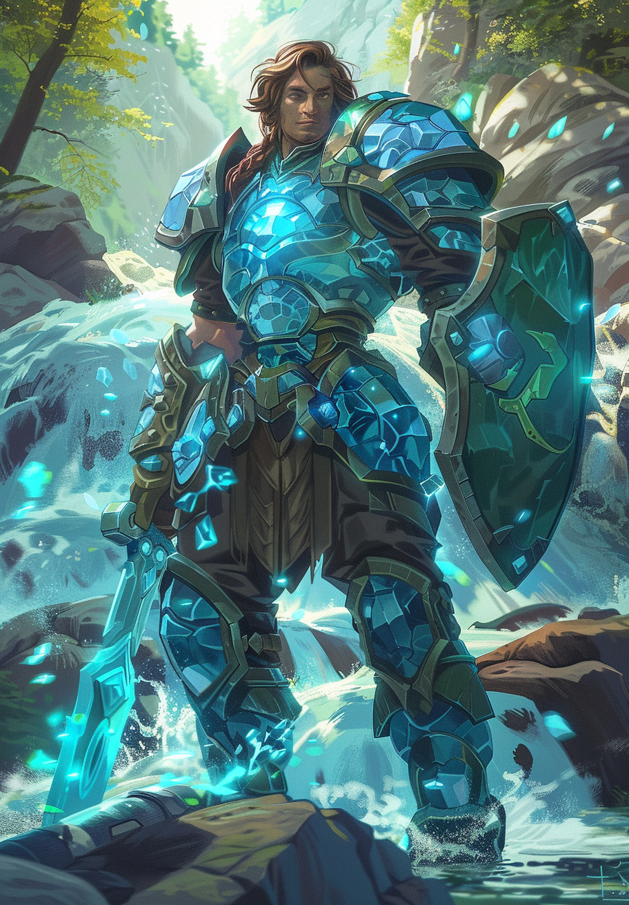 | Torrick, Gardien du Torrent | Mythic | 81 | 24 | 1350 | Eau | Soin mineur : inflige des dégâts élément eau avec un effet secondaire. Si cible Feu : Mouillé retire Brûlure, + applique Vapeur. |
| 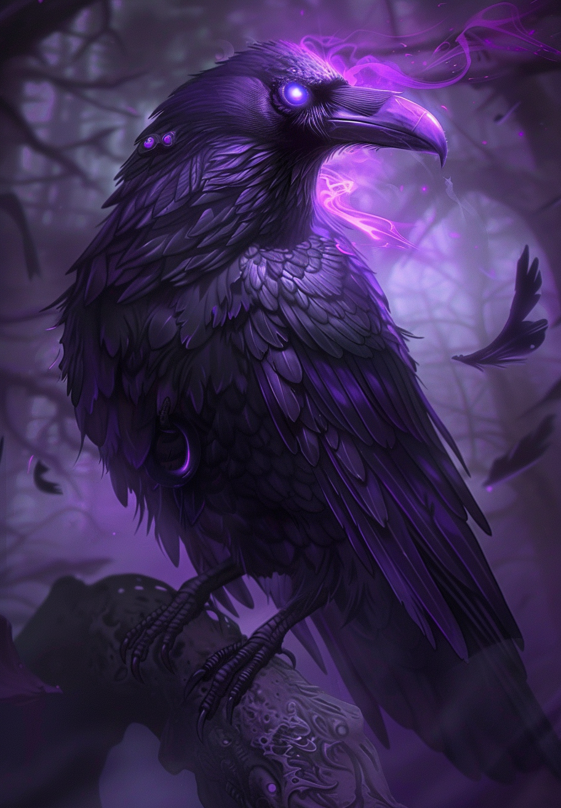 | Corvus, Corbeau Mystique | Rare | 65 | 20 | 1060 | Air | Attaque de base : inflige des dégâts élément air/ténèbres avec un effet secondaire. Si cible Mouillée : Brûlure annulée, applique Vapeur (-15% Précision, 2 tours). |
| 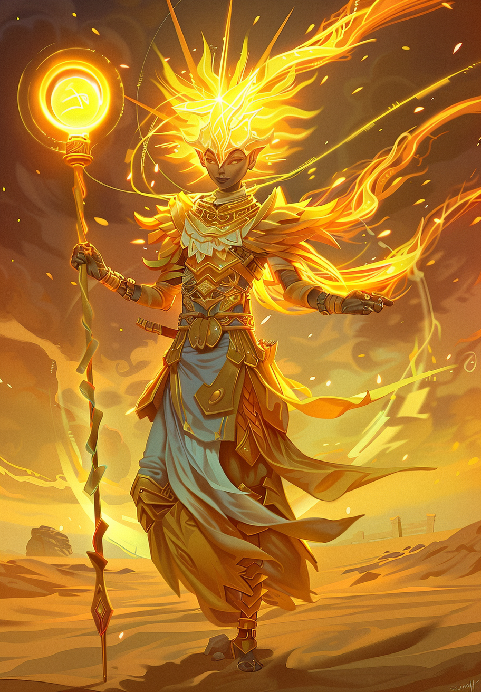 | Solune, Chamane Solaire | Uncommon | 48 | 14 | 850 | Feu | Attaque de base : inflige des dégâts élément feu/lumière avec un effet secondaire. Si cible Ténèbres : Aveuglement 2 tours. Si subit Glace : Aveuglement impossible ce tour. |
| 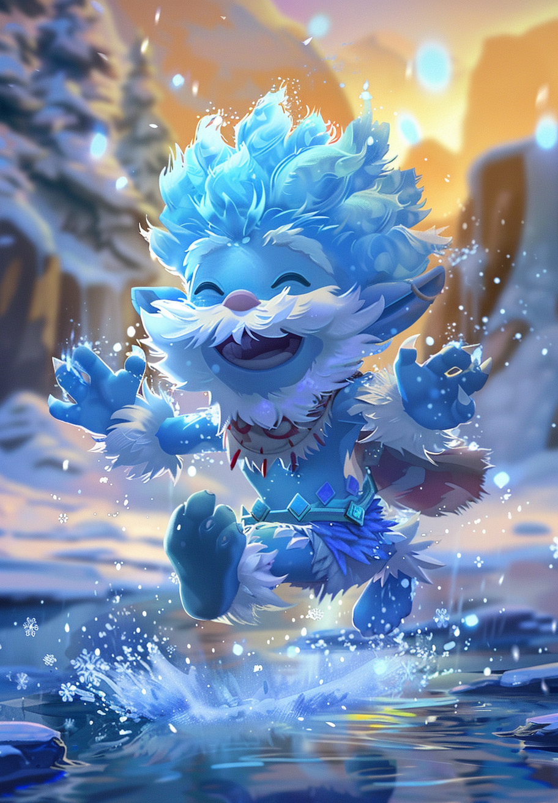 | Gélax, Lutin de la Banquise | Common | 42 | 16 | 810 | Glace | Spores Acides : Poison (DoT 9, 2 tours), 35% de Mouillé. Si cible Eau : Poison DoT doublé. Si subit Feu : détruit les spores; Poison impossible ce tour. |
| 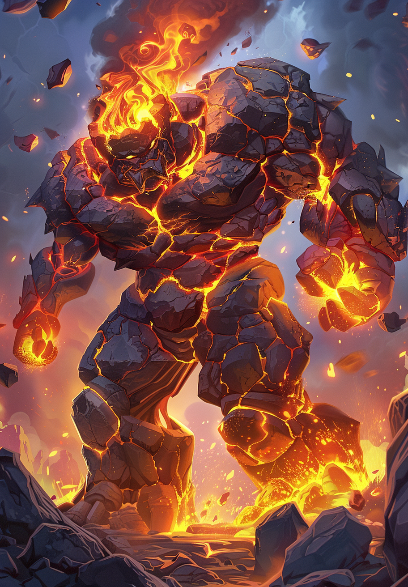 | Pyraxis, Élémentaire de Magma | Uncommon | 52 | 13 | 780 | Feu | Attaque de base : inflige des dégâts élément feu/terre avec un effet secondaire. Si cible Feu ou Terre : Mouillé 100%. Si subit Glace : DoT -50% (plus résistante au froid). |
| 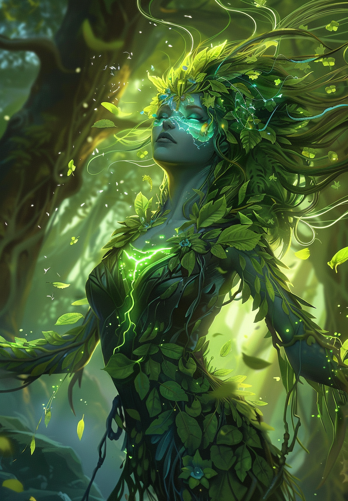 | Sylvara, Esprit de la Canopée | Mythic | 81 | 27 | 1220 | Terre | Attaque de base : inflige des dégâts élément terre/air avec un effet secondaire. Si cible Mouillée : soigne 10 PV bonus à tous. Si subit Poison : soin automatique sur elle-même (30 PV au prochain tour). |
| 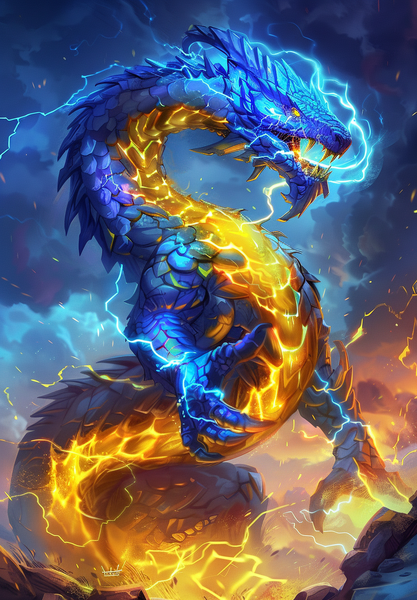 | Voltania, Serpent Fulgurant | Rare | 54 | 16 | 950 | Foudre | Étincelle : inflige des dégâts élément foudre avec un effet secondaire. Orage : inflige des dégâts élément foudre avec un effet secondaire. Si subit Terre : DEF 0 ce tour. |
| 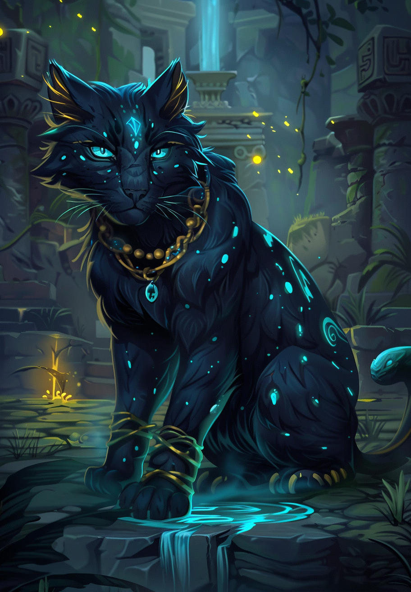 | Abyssine, Félin des Profondeurs | Uncommon | 44 | 23 | 1020 | Eau | Carapace Humide : Bouclier 45, Mouillé 100% sur lui. Si subit Foudre : perd la moitié de ses PV actuels (combo détriment). Attaque de base : inflige des dégâts élément eau/ténèbres avec un effet secondaire. |
| 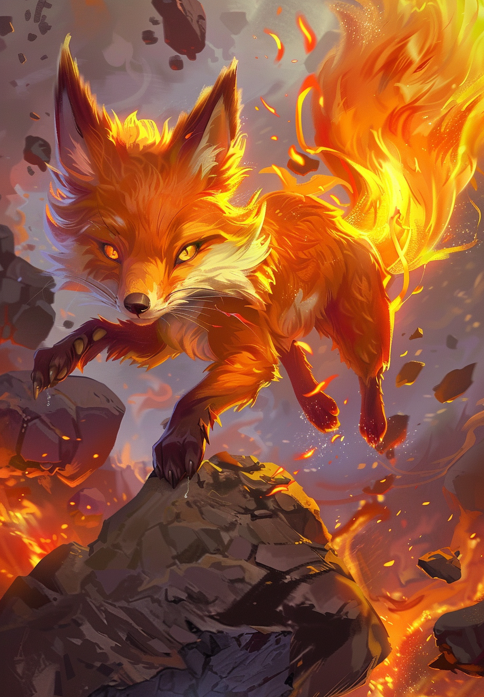 | Firocus, Renard Volcanique | Rare | 65 | 13 | 830 | Feu | Cône de flammes : inflige des dégâts élément feu avec un effet secondaire. Si cible Lumière : Silence impossible ; subit aveuglement à la place. Si subit Glace : Esquive impossible. |
| 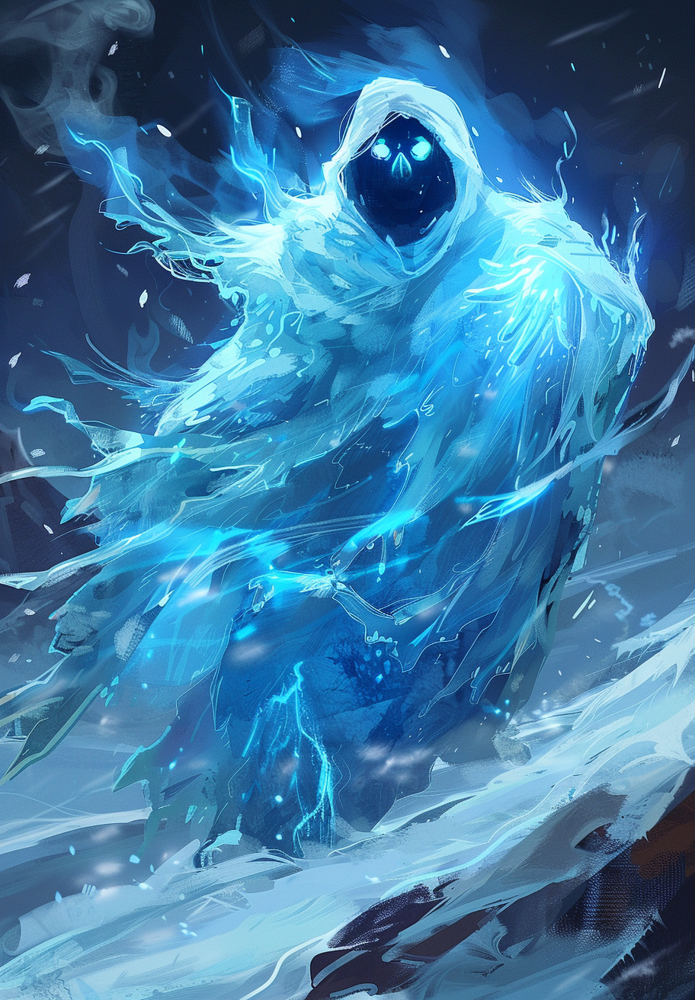 | Brumys, Fantôme du Givre | Rare | 60 | 19 | 980 | Glace | Aubier Protecteur : Soigne 36 PV + Bouclier 30 à un allié, retire Poison et Paralysie. Si cible Mouillée : Soins +15%. Si subit Ténèbres : soins -50% sur elle. |
| 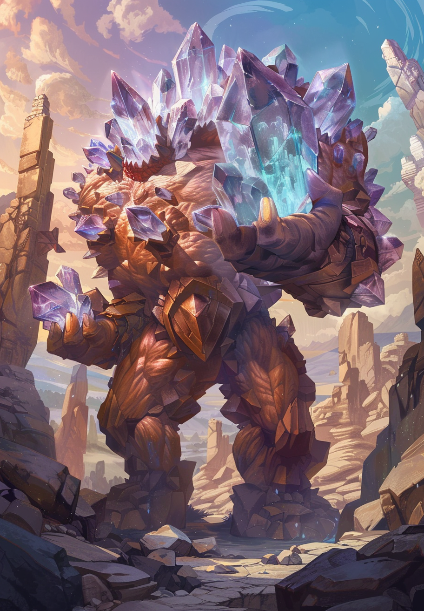 | Lithos, Colosse de Quartz | Epique | 76 | 16 | 990 | Terre | Provocation : inflige des dégâts élément terre avec un effet secondaire. Si cible Eau : Brûlure impossible, toujours Gel. Si cible Mouillée : applique Vapeur à la place (-15% précision, 2 tours). |
| 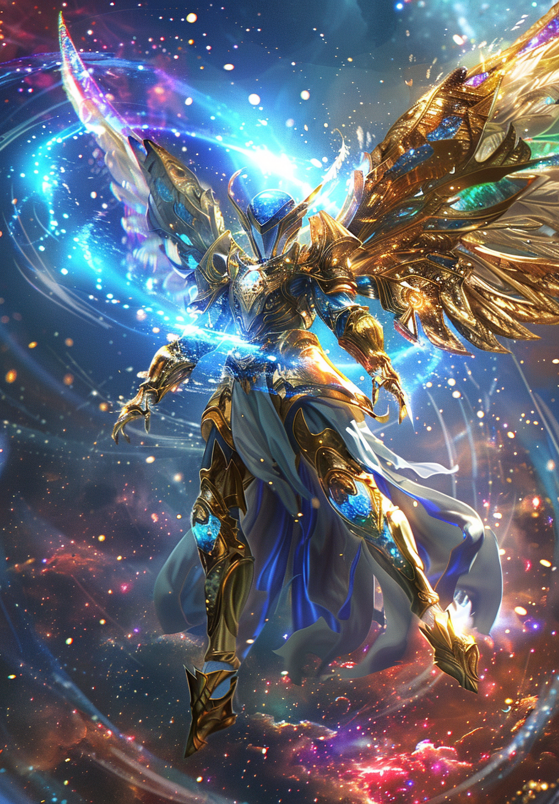 | Astrilys, Sentinelle Astrale | Uncommon | 49 | 15 | 800 | Lumiere | Attaque de base : inflige des dégâts élément lumière/air avec un effet secondaire. Si cible Lumière : 100% Silence + Aveuglement (-25% précision 1 tour). Si subit Poison : perd Silence. |
| 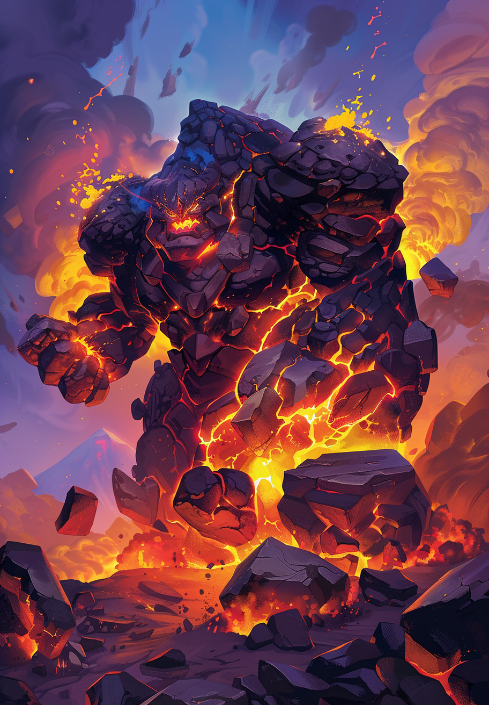 | Ignarok, Roc en Fusion | Rare | 59 | 16 | 870 | Feu | Attaque de base : inflige des dégâts élément feu/terre avec un effet secondaire. Si cible Feu ou Terre : DoT +7 sur Mouillé. Si subit Foudre : Tyfona perd 30% de ses PV. |
|  | Sylvert, Gardien de la Brume | Uncommon | 53 | 34 | 1200 | Terre | Plaques Inflexibles : Bouclier 75 à un allié, confère Immunité à Brûlure. Si subit Eau : Bouclier réduit de moitié. Si subit Foudre : ATK réduite de 15%. |
| 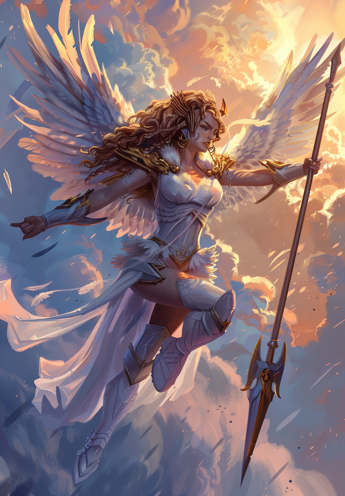 | Zéphara, Valkyrie des Vents | Epique | 70 | 22 | 980 | Air | Barrière Sacralisante : Bouclier 65 et Soin 24 sur tous les alliés. Si cible Ténèbres : le soin est doublé. Si subit Poison : Barrière 50% efficace. |
| 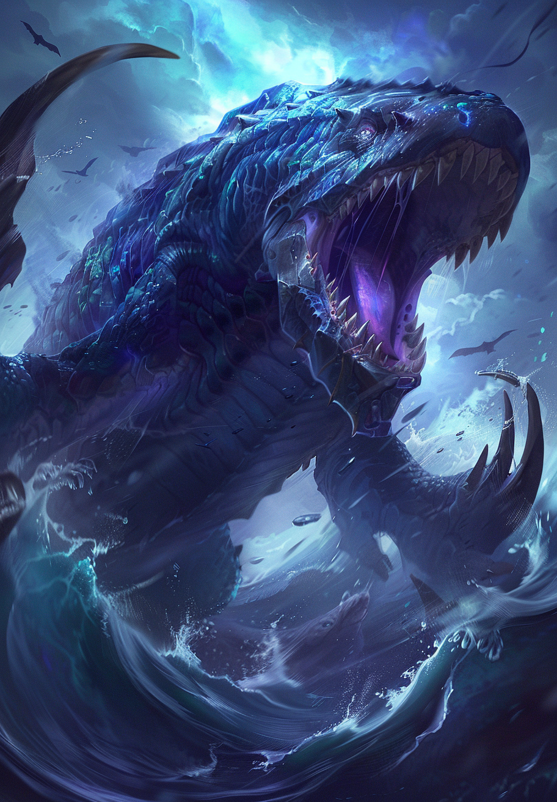 | Typhion, Léviathan du Maelström | Mythic | 91 | 16 | 1111 | Eau | Odeur Fétide : Poison 14 (sur 2t) sur toute l'équipe adverse, silence 1 tour (cible au hasard). Si cible Lumière : Silence impossible, Poison X2 sur elle. Attaque de base : inflige des dégâts élément eau/ténèbres avec un effet secondaire. |
|  | Prismalyx, Papillon Lumineux | Epique | 58 | 14 | 861 | Lumiere | Immunité : inflige des dégâts élément lumière avec un effet secondaire. Protection divine : inflige des dégâts élément lumière avec un effet secondaire. Si cible Mouillée : applique Brume (précision -30%). Si subit Poison : Esquive impossible. [Boost: +5% PV/ATK, +1 DEF, promue EPIQUE] |
| 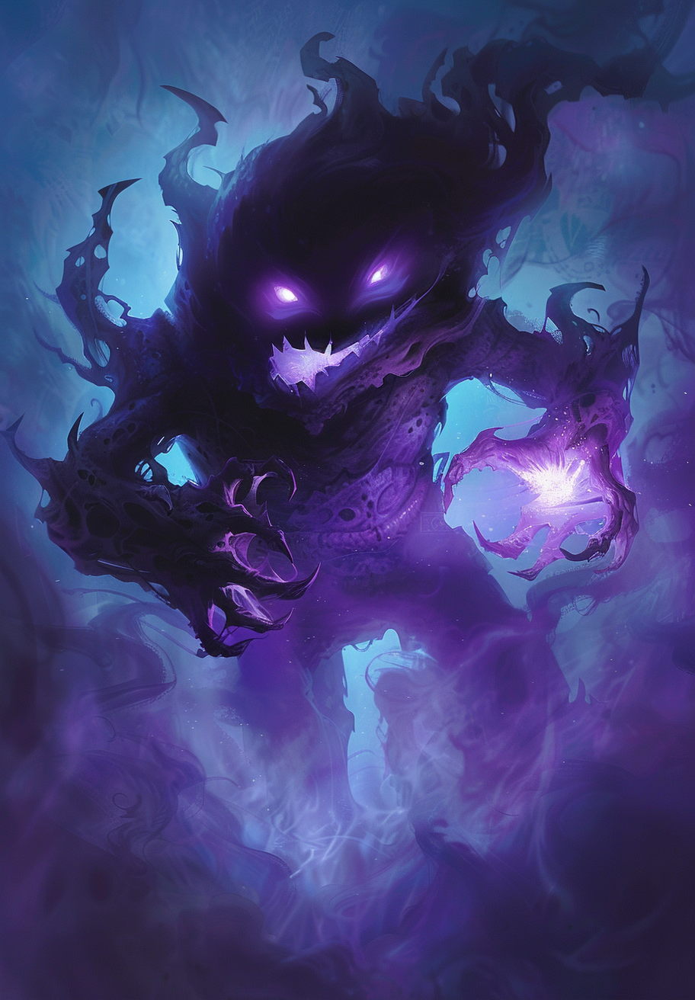 | Murkax, Ombre Rampante | Epique | 80 | 24 | 1300 | Tenebres | Drain de vie : inflige des dégâts élément ténèbres avec un effet secondaire. Si cible Lumière : Silence impossible, mais gagne +20% ATK ce tour. Ombres rampantes : inflige des dégâts élément ténèbres avec un effet secondaire. |
| 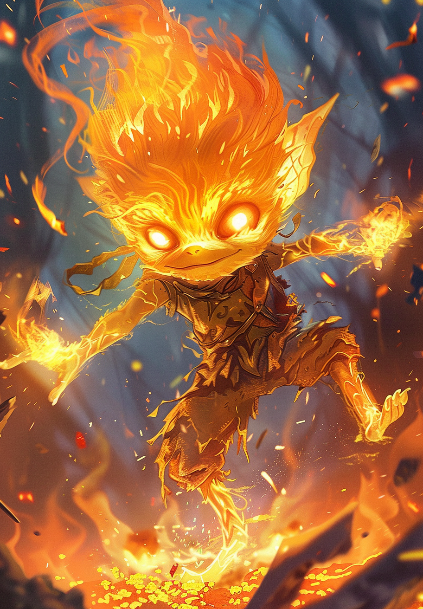 | Flamby, Lutin des Flammes | Common | 37 | 8 | 710 | Feu | Brasier Malicieux : Brûlure (DoT 8/2t). Brûlure : inflige des dégâts élément feu avec un effet secondaire. Si subit Eau : Brûlure impossible. |
| 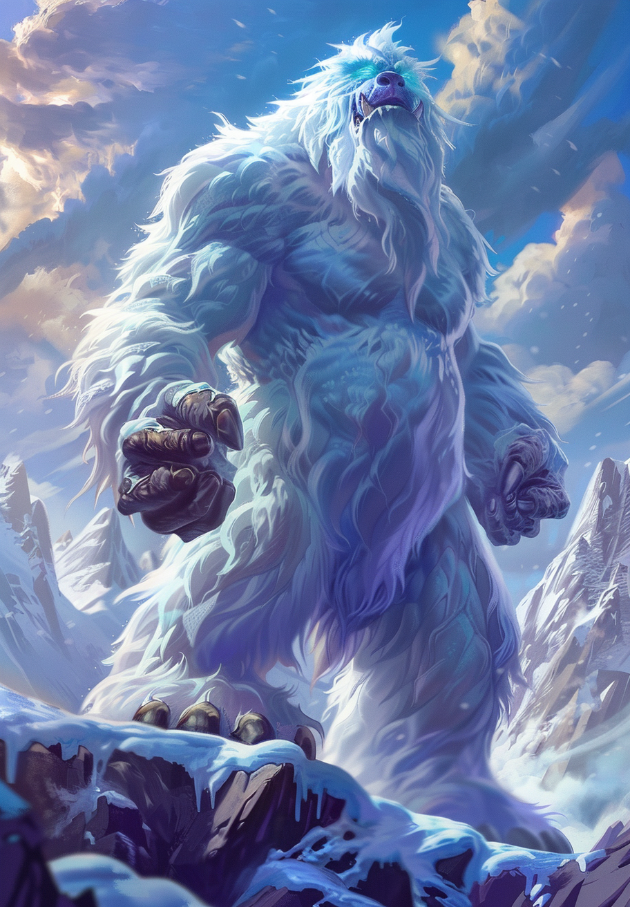 | Glaciar, Yéti des Sommets | Rare | 65 | 14 | 920 | Glace | Attaque de base : inflige des dégâts élément glace/terre avec un effet secondaire. Si cible Mouillée : Gel garanti. Si subit Feu : perd 20% pv actuels. |
| 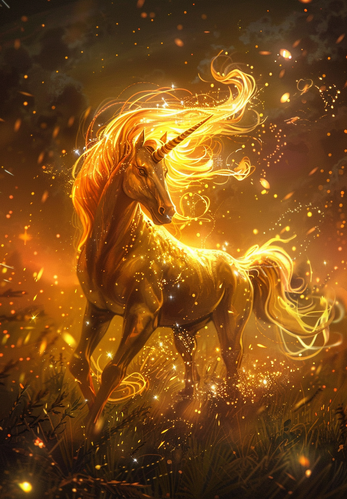 | Lumicorne, Licorne Dorée | Uncommon | 58 | 11 | 830 | Lumiere | Immunité : inflige des dégâts élément lumière avec un effet secondaire. Si cible Lumière : Mouillé impossible. Si subit Poison : DoT Poison doublé sur lui. |
| 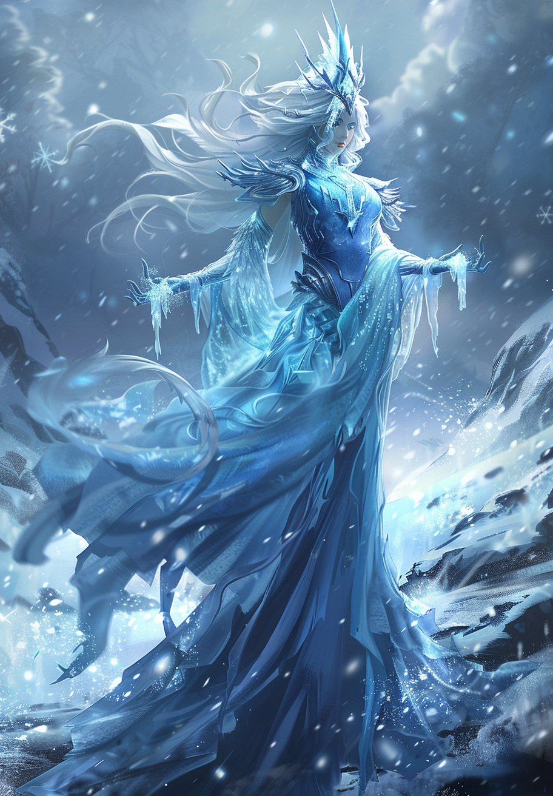 | Galádra, Matriarche du Givre | Rare | 61 | 19 | 1040 | Glace | Mur de glace : inflige des dégâts élément glace avec un effet secondaire. Si cible Air : Ignorer Bouclier. Gel : inflige des dégâts élément glace avec un effet secondaire. |
| 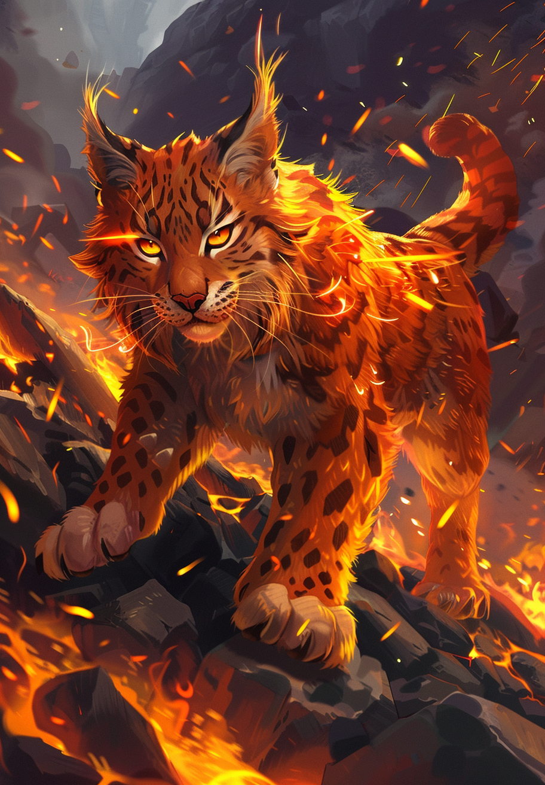 | Pyrolynx, Lynx Ardent | Epique | 74 | 17 | 870 | Feu | Tourbillon Purifiant : Retire tous statuts négatifs d'un allié, soigne 32 PV, augmente esquive 2 tours (50%). Si cible Mouillée : Soins +12 PV. Si subit Ténèbres : Esquive inefficace ce tour. |
| 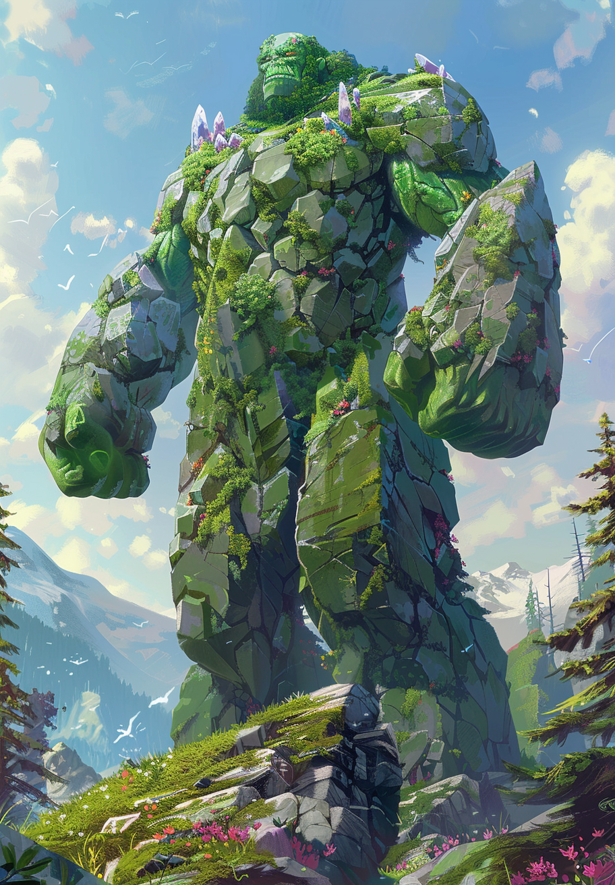 | Telluron, Géant de Schiste | Rare | 58 | 13 | 790 | Terre | Provocation : inflige des dégâts élément terre avec un effet secondaire. Si cible Lumière : Aveuglement toujours garanti. Provocation : inflige des dégâts élément terre avec un effet secondaire. |
|  | Lumys, Renardeau Solaire | Mythic | 79 | 21 | 1030 | Lumiere | Rosée de Grâce : Soigne 35 à tous les alliés + retire Poison/Brûlure/Mouillé. Si cible Mouillée : Soin +15%. Si subit Foudre : ne peut pas soigner ce tour. |
| 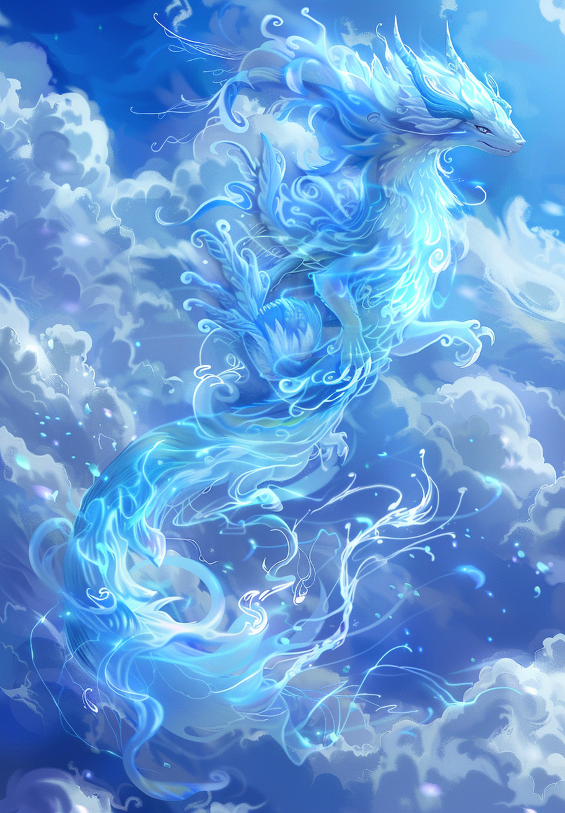 | Stratos, Esprit des Courants | Epique | 88 | 12 | 950 | Air | Esquive accrue : inflige des dégâts élément air avec un effet secondaire. Tornade : inflige des dégâts élément air avec un effet secondaire. Si subit Glace : ATK -20% ce tour. |

### Héros
| Image | Nom | PV | ATK | DEF | Élément | Pouvoir spécial | Passif |
|-------|-----|----|-----|-----|---------|-----------------|--------|
| 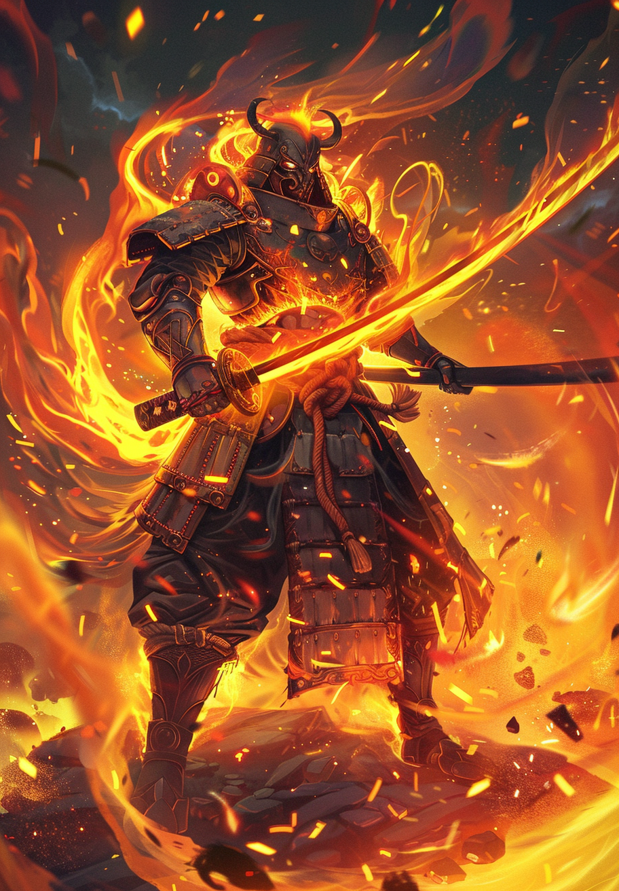 | Solaris, Champion des Cendres | 1100 | 55 | 22 | Feu | Inferno Purificateur : Inflige 80 dégâts à tous les ennemis + Brûlure (2 tours). | Alliés Feu +10 % dégâts contre Nature. (+1 coût) |
| 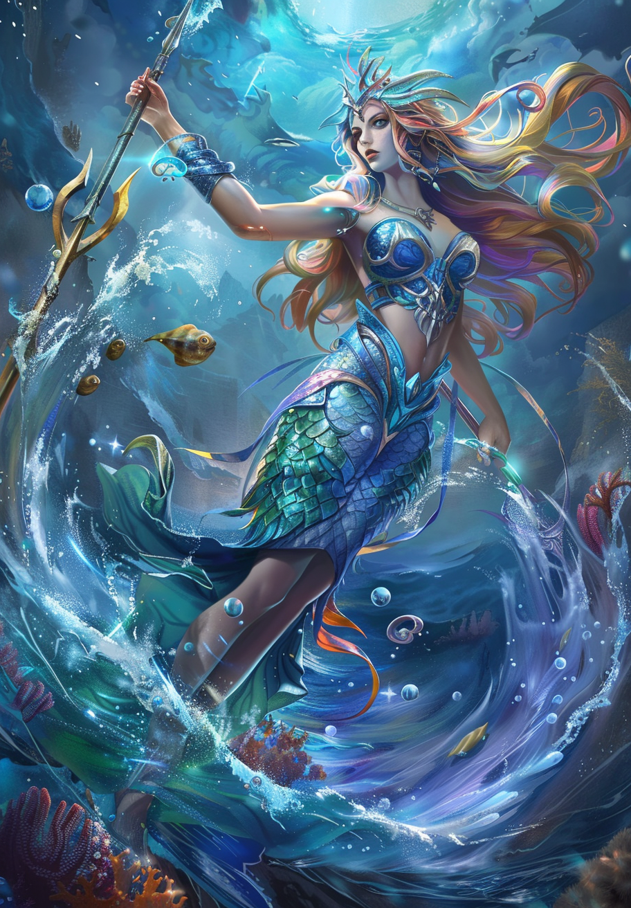 | Aquarielle, Gardienne des Marées | 1200 | 45 | 24 | Eau | Vague Régénératrice : Soigne 70 PV à tous les alliés + retire Brûlure/Poison. | Alliés Eau -20 % dégâts Feu. (+2 coût) |
| 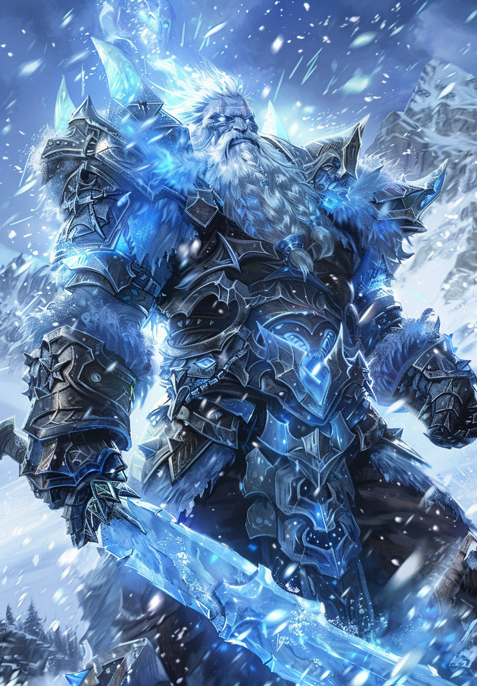 | Glacius, Empereur du Givre | 1150 | 50 | 26 | Glace | Tempête de Givre : 60 dégâts à tous + Gel (1 tour). | -10 % vitesse ennemie. (+2 coût) |
| 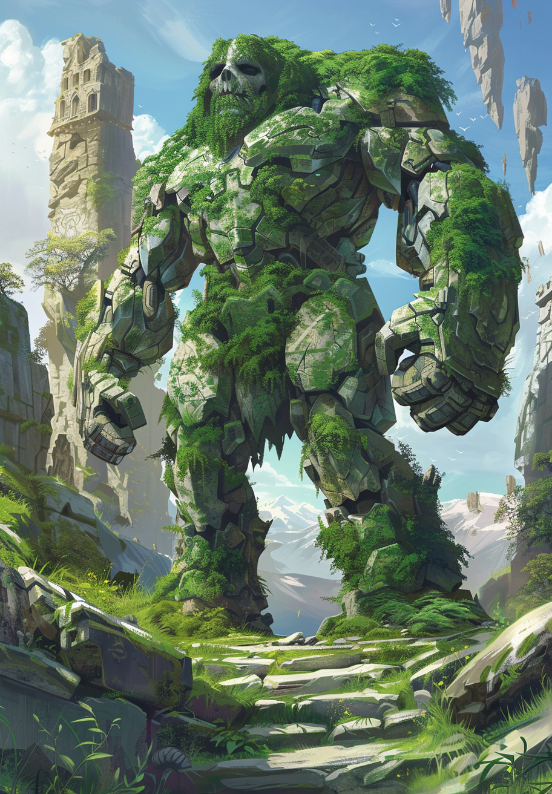 | Telluron, Cœur de la Montagne | 1300 | 40 | 30 | Terre | Barrière Rocailleuse : Bouclier 150 PV à tous les alliés (2 tours). | Alliés Terre +5 DEF. (+1 coût) |
|  | Zephira, Esprit des Tempêtes | 1000 | 60 | 20 | Air | Danse des Rafales : Réinitialise les cooldowns des alliés (sauf Ultis). | Alliés Air +10 % esquive. (+3 coût) |
| 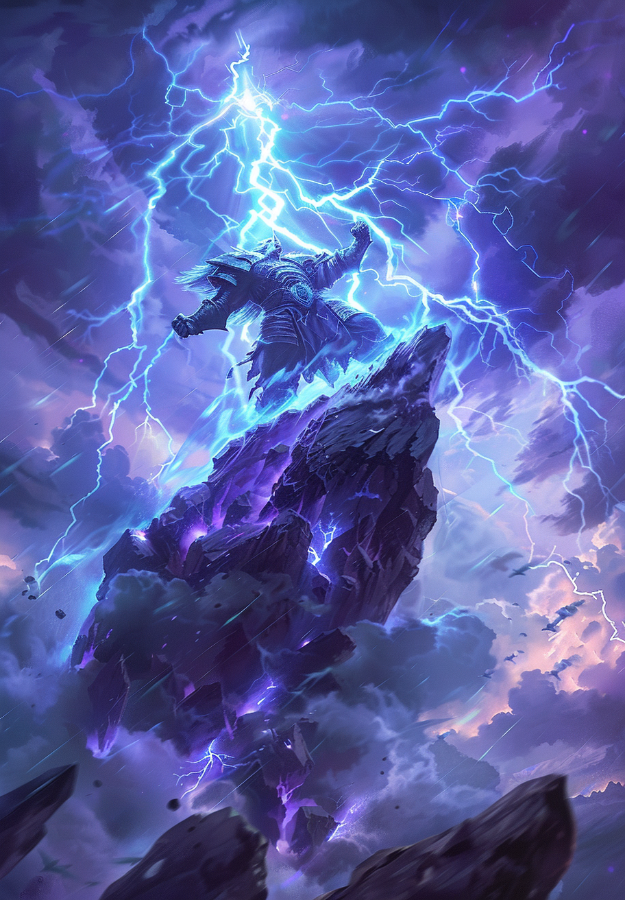 | Voltarn, Seigneur des Orages | 1050 | 65 | 18 | Foudre | Orage Implacable : Inflige 90 dégâts aléatoires + 20 % de chance de Paralysie. | Attaques Foudre → 10 % chance de Paralyser. (+2 coût) |
| 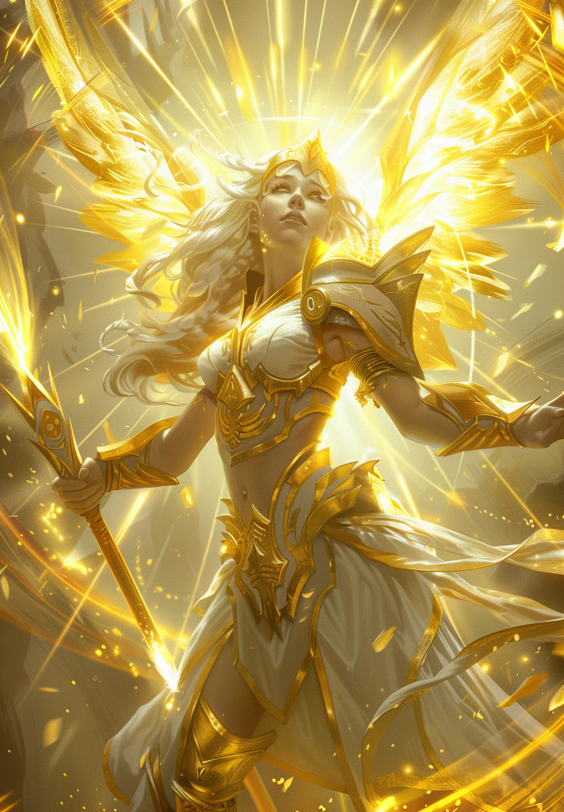 | Luxielle, Avatar Radieux | 1150 | 50 | 25 | Lumiere | Bénédiction Solaire : Soin de 50 PV à tous + Immunité 1 tour contre les effets négatifs. | Alliés Lumière reçoivent -15 % dégâts Ténèbres. (+2 coût) |
| 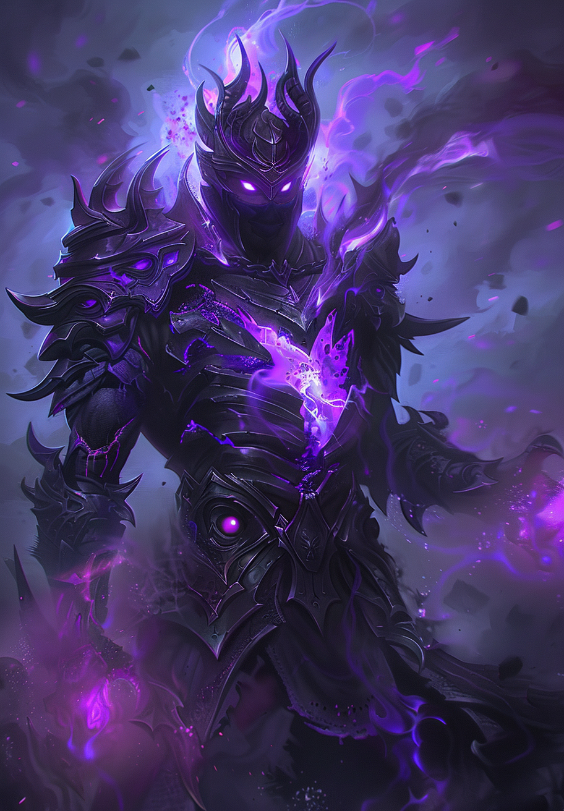 | Mortrax, Sombre Dominateur | 1100 | 60 | 23 | Tenebres | Siphon d'Ombres : Inflige 80 dégâts + Drain de vie (50 % des dégâts). | Alliés Ténèbres +15 % contre Lumière. (+2 coût) |
| 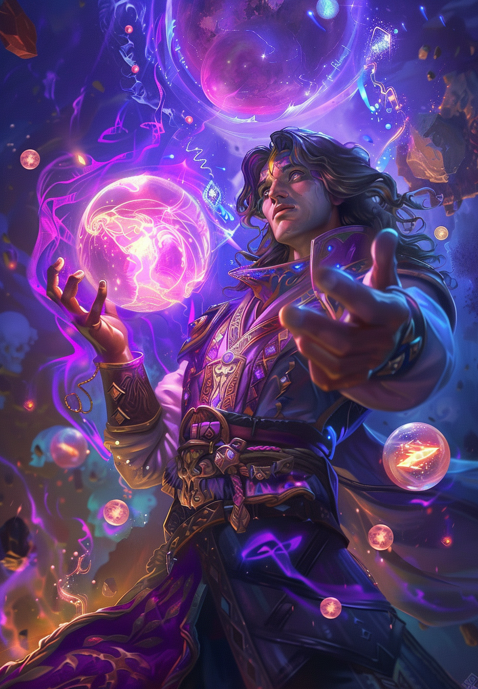 | Arcanis, Sage des Flux Mystiques | 1050 | 55 | 22 | Arcanique | Distorsion du Temps : Avance ou recule le cooldown d'une capacité alliée ou ennemie. | -1 tour de cooldown global sur le deck. (+2 coût) |
| 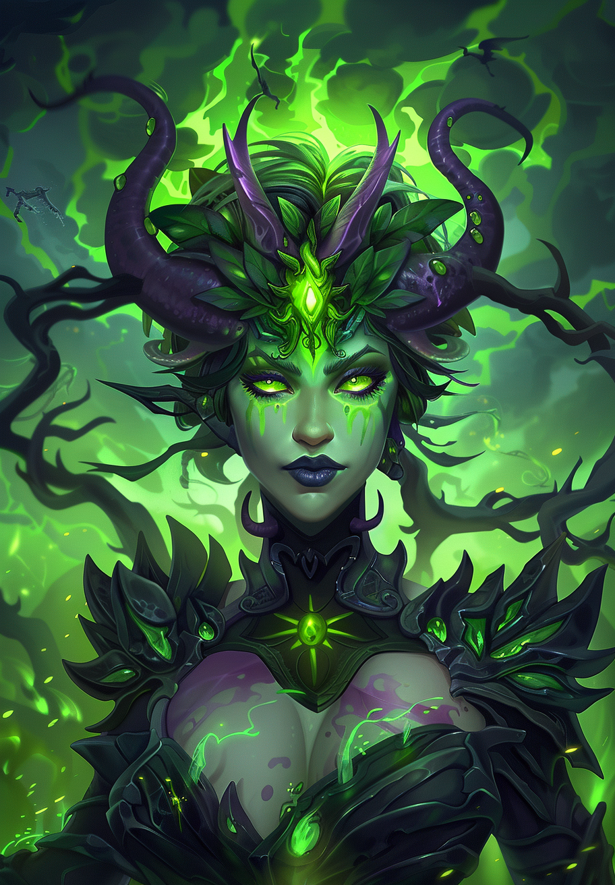 | Toxina, Reine des Venins | 1100 | 58 | 20 | Poison | Nuage Infectieux : Inflige 40 dégâts à tous les ennemis + Poison (3 tours). | Les alliés Poison appliquent un Poison plus fort (5 dégâts/tour au lieu de 3). (+1 coût) |
| 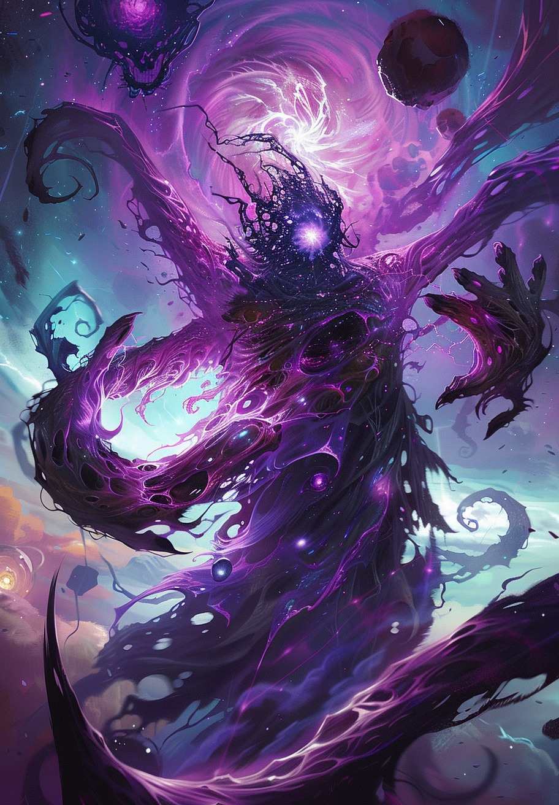 | Nihilos, Avatar du Néant | 1150 | 60 | 20 | Neant | Annihilation Instantanée : Tente d'éliminer instantanément une carte ennemie faible (<30 % PV), sinon inflige 100 dégâts. | Immunisé aux effets élémentaires (Brûlure, Gel, etc.). (+3 coût) |

### Sorts & Équipements
| Nom | Rareté | Coût | Élément | Description |
|-----|--------|------|---------|-------------|
| Brasier Fulminant | Rare | 3 | Feu | 40 dégâts, Brûlure 12 (DoT, 2t). Si cible Mouillée/Gelée : Brûlure annulée, applique Vapeur (-15% précision, 1t). [Feu] |
| Onde Pyrique | Uncommon | 4 | Feu | 28 dégâts à tous ennemis, Brûlure 8 (1t). Si cible Mouillée : Brûlure annulée sur elle (reste dégâts). [Feu] |

---

## 3. Decks et Collection
- Un deck = 1 héros + 20 cartes max (unités, sorts, équipements).
- 5 decks maximum par joueur.
- 2 exemplaires max par carte dans un deck.
- Toutes les cartes possédées sont visibles dans la collection.
- Les doublons (plus de 2 exemplaires) sont automatiquement convertis en pièces.
- Un booster = 8 cartes (3 unités, 4 sorts/équipements, 1 bonus).
- Les probabilités de rareté sont affichées.
- Les doublons sont transformés en pièces lors de l'ouverture.

---

## 4. Interface et accessibilité
- Navigation clavier complète (tab, flèches, Entrée/Espace).
- Feedback visuel et sonore (animations, sons, popups).
- Mode daltonien et accessibilité (aura adaptée, tooltips explicites).

---

## 5. Avancées, extensions et communauté
- Mode multi-joueur (hotseat, réseau).
- Nouvelles familles de cartes, nouveaux effets.
- API serveur, migration cloud.
- Lien vers le guide de contribution, Discord, issues GitHub, email de contact.

---

## 6. Glossaire et conseils
- Explication de tous les termes du jeu.
- Tableau des faiblesses élémentaires.
- Exemples de combos et stratégies.
- Section "Trucs & Astuces" pour les nouveaux joueurs.
- Changelog : historique des mises à jour.

---

# (Les sections Unités, Héros, Sorts & Équipements seront générées automatiquement à partir des sets du jeu) 